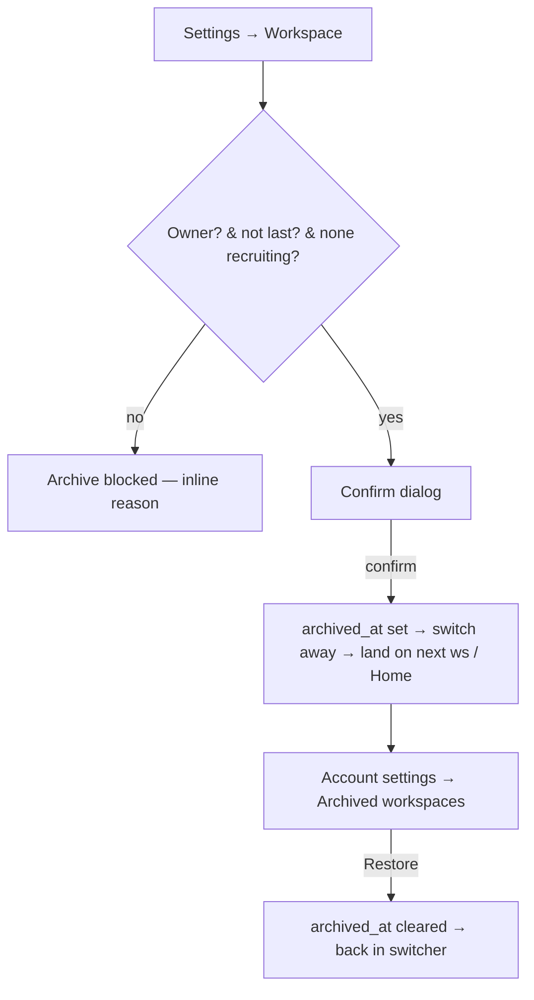

# User flow — Archive & restore a workspace

- **Job-to-be-done:** [Get set up](../jobs-to-be-done/get-set-up.md)
- **Primary persona:** [Postdoc operator](../personas/postdoc-operator.md)
- **Secondary personas (if any):** [Multi-site coordinator](../personas/multi-site-coordinator.md)
- **Grounding insights:** [Researcher tooling pain points](../../01_research/insights/researcher-tooling-pain-points.md)
- **Status:** draft

## Goal

Let a workspace owner remove a workspace they no longer need from their switcher —
without destroying anything — and bring it back later if they change their mind.

## Preconditions

Signed in; onboarding complete. The user **owns** the workspace they want to archive
(archive is owner-only; non-owners don't see the control). The user belongs to at least
one *other* non-archived workspace, OR is willing to keep this one (see rule 1 below).

## Postconditions

Either: the workspace is **archived** — hidden from the switcher and from being resolved
as the active workspace, with all its studies/versions/responses/members/saves intact and
restorable; the user has landed on their next workspace (or Home). Or: the workspace is
**restored** — back in the switcher exactly as it was. Reversible; nothing is destroyed
(ADR-0090).

## Happy path

**Archive**

1. Owner opens the workspace's **Settings → Workspace** (`/settings/workspace`).
   (Trigger: left-rail Settings.)
2. At the bottom, an **Archive this workspace** section explains what archiving does
   ("hides it for everyone; nothing is deleted; you can restore it anytime") and shows an
   **Archive workspace** button.
3. Owner clicks it → a confirmation dialog names the workspace and its contents ("N
   studies will be hidden — you can restore them anytime"). Owner confirms.
4. System sets `archived_at`, switches the active workspace away, and lands the owner on
   their next workspace's dashboard (or `/home` if they have none left), with a toast:
   "'{name}' archived — restore it in Account settings."

**Restore**

5. User opens **Account settings** (`/settings/account`) → an **Archived workspaces**
   section lists each archived workspace they own (name + when archived + study count).
6. User clicks **Restore** on a row → system clears `archived_at`; the workspace re-appears
   in the switcher; toast: "'{name}' restored." The row leaves the archived list.

## Branches and decision points

- **Decision — this is the owner's last active workspace.**
  - **Path A (blocked):** the Archive button is disabled with a hint ("This is your only
    workspace — create another first"); the mutation also refuses server-side
    (`PRECONDITION_FAILED`). No archive occurs.
  - **Path B (has others):** archive proceeds as the happy path.
- **Decision — a study in the workspace is still recruiting.**
  - **Path A (blocked):** confirm dialog / mutation refuses with "Stop recruitment on
    {study} before archiving." The owner stops recruitment (Studies · Running), then
    returns.
  - **Path B (none recruiting):** archive proceeds.
- **Decision — non-owner viewing Settings:** the Archive section is not rendered (they
  can leave the workspace or archive their own studies instead — separate flows).

## Failure modes

- **Trigger:** archive mutation rejects (last-workspace or recruiting guard).
  **System response:** inline error in the dialog with the specific reason; the workspace
  is unchanged. **Recovery:** create another workspace / stop recruitment, then retry.
- **Trigger:** restore fails (transient).
  **System response:** toast error; the row stays in the archived list. **Recovery:**
  retry — restore is idempotent (clearing an already-clear `archived_at` is a no-op).
- **Trigger:** the active-workspace cookie still points at the just-archived workspace on
  the next request. **System response:** `resolveActiveWorkspace` filters archived, so it
  falls back to the owned-then-earliest workspace (or Home) automatically. **Recovery:**
  none needed.

## Out of scope

- **Permanent deletion / data purge** — deliberately not offered (ADR-0090 chose
  reversible archive; a future GDPR-erasure ADR would cover purge).
- **Per-member "hide from my switcher"** independent of the owner's archive — out of scope
  for V1.
- **Leaving / renaming a workspace, managing members** — [manage-team-members](manage-team-members.md)
  and account/workspace settings.
- **Archiving an individual study** (already exists) vs. the whole workspace — this flow is
  the workspace level only.

## Open questions

- Should restore also re-select the workspace as active (land the user in it), or just
  return it to the switcher? Leaning: just return it (less surprising); owner to confirm.
- Do we surface archived workspaces anywhere besides Account settings (e.g. a "Show
  archived" toggle in the switcher)? Deferred unless requested.

## Diagram

