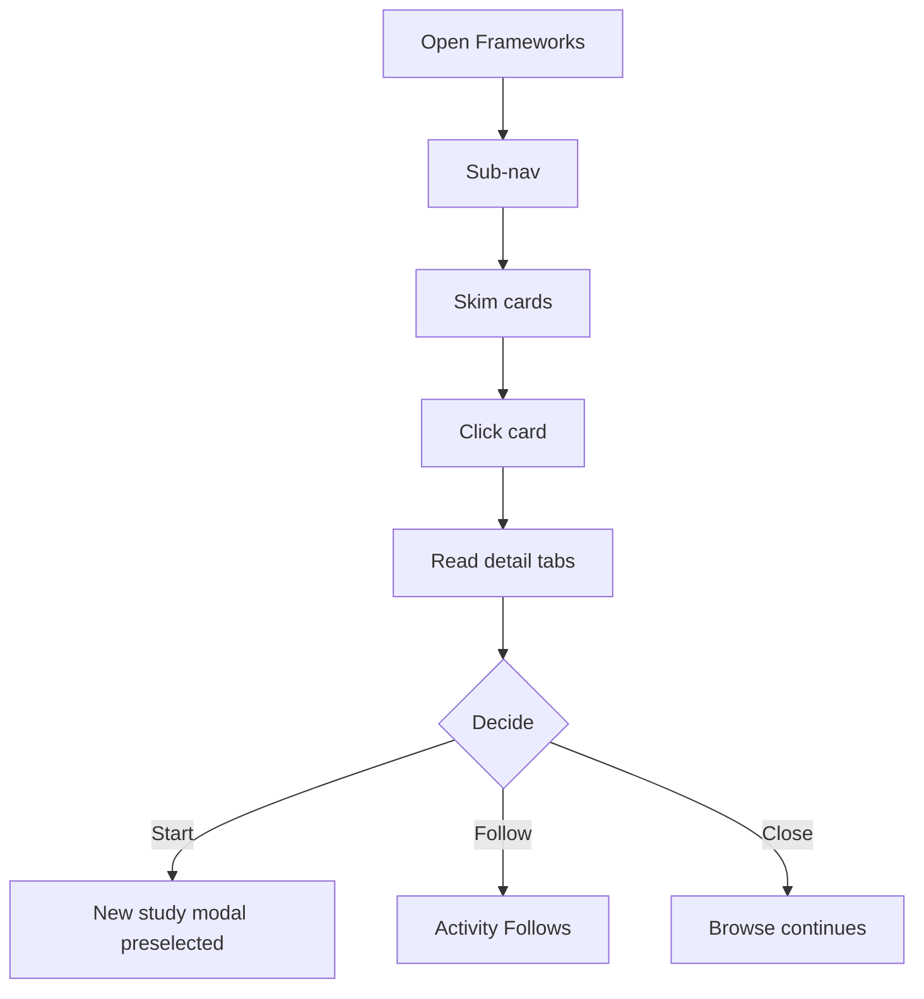

# User flow — Browse frameworks

- **Job-to-be-done:** [Build a study](../jobs-to-be-done/build-a-study.md)
- **Primary persona:** [Hanna Kowalczyk — postdoc operator](../personas/postdoc-operator.md)
- **Secondary personas (if any):** [Maya Okonkwo — PI](../personas/principal-investigator.md), [Marek Stein — multi-site coordinator](../personas/multi-site-coordinator.md)
- **Grounding insights:** [persona-segmentation-and-strategic-risks](../../01_research/insights/persona-segmentation-and-strategic-risks.md)
- **Status:** draft

## Goal

The user finds a Framework matching their research tradition and either starts a study from it or follows it for new versions / studies derived from it.

## Preconditions

- Signed in, inside a workspace.
- At least one Framework available (V1 launches with Misinformation Research Framework).

## Postconditions

- The user has clicked "Start a study from this Framework", followed it, or closed the surface — state persists.

## Happy path

1. **Open Frameworks** from left rail. Sub-nav: All / Verified / By theme / My drafts.
2. **Skim cards.** Framework name (Plex Serif display), verified badge if curator-approved, theme tag, version, "studies derived" count, short description.
3. **Click a card.** Routes to Framework detail — same chrome as a study (slim top bar, center-column pill: Overview · Used in · Versions · References).
4. **Read.** Overview = schema, recommended modules, measurement opinions, reporting conventions. References = academic citations.
5. **Decide.** Top-right action: `Start a study from this Framework` (primary) or `+ Follow` (secondary).

## Branches and decision points

### Decision 1 (step 5) — start study, follow, or close

- **Decision:** Framework matches need (start), interesting but not now (follow), or wrong fit (close).
- **Path A — Start a study:** opens New study modal with Framework preselected.
- **Path B — Follow:** subscribes to Framework version updates + studies derived from it.
- **Path C — Close:** no commitment; state preserved.

## Failure modes

- **Framework deprecated** — banner with migration target.
- **No author permission** — primary button shows "Read-only — your role can't author studies"; Follow remains.

## Out of scope

- Authoring a Framework (Framework-contributor flow).
- Curator review pipeline (admin flow).

## Open questions

- "Used in" cross-workspace — public studies only. Confirmed.
- Submit-template-to-Framework affordance placement — same surface, Used in → Templates tab.

## Diagram

## Sources

- IA v0.3 — Frameworks destination, Templates revoked as alias.
- ADR-0009 — Frameworks as default-virtue; verified badge.
- ADR-0001 — Framework + FrameworkVersion model.
- Brief v0.6 — Framework chrome inherits slim-top-bar + center-column-stack.
