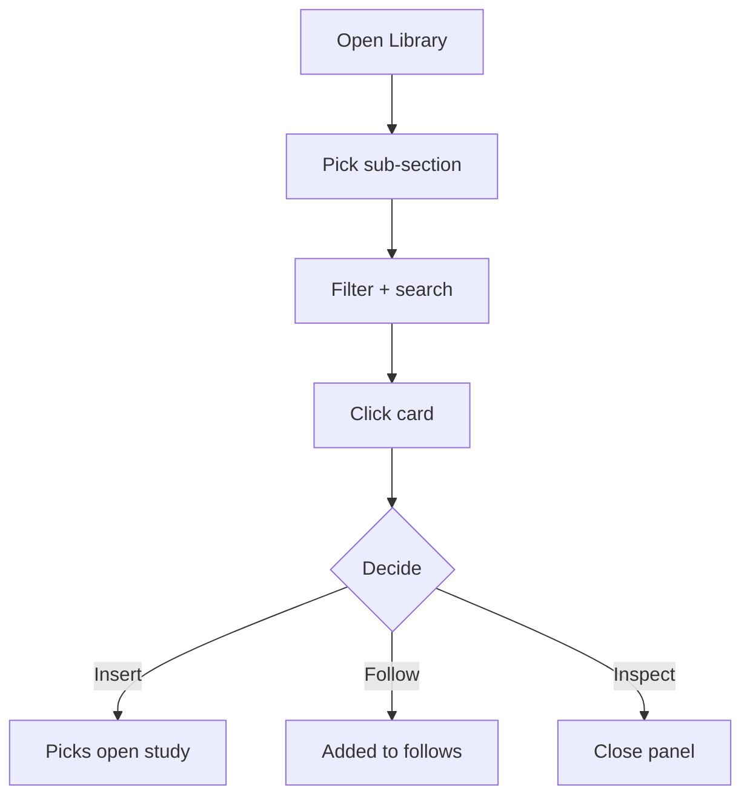

# User flow — Browse library

- **Job-to-be-done:** [Build a study](../jobs-to-be-done/build-a-study.md)
- **Primary persona:** [Hanna Kowalczyk — postdoc operator](../personas/postdoc-operator.md)
- **Secondary personas (if any):** …
- **Grounding insights:** [researcher-tooling-pain-points](../../01_research/insights/researcher-tooling-pain-points.md)
- **Status:** draft

## Goal

The user finds a module, theme, asset, or template in Library — either to use in a study they're authoring or to evaluate as a reusable instrument.

## Preconditions

- Signed in, inside a workspace.

## Postconditions

- The user has either selected an item to insert, starred / followed an item, or navigated away — Library state (scroll, filter, sort) persists for next visit.

## Happy path

1. **Open Library** from left rail. Sub-nav: Modules / Themes / Materials / Templates / Imports.
2. **Pick a sub-section.** Work surface shows the catalogue — title, version, theme tag, "used in" count, last-updated.
3. **Filter and search.** Filter chips: theme, category, "verified" badge. Search opens scoped search (Library scope preselected).
4. **Click a card.** Right context panel switches to item detail tabs: Details / Schema / Versions / Used in.
5. **Decide.** Either click "Insert into..." (picks an open study draft), `+ Follow`, or close and continue browsing.

## Branches and decision points

### Decision 1 (step 5) — what to do with the picked item

- **Decision:** insert into an open study, follow for updates, or just inspect.
- **Path A — Insert into…:** popover picks open study; module appears at end of study.
- **Path B — Follow:** module added to follow targets; surfaces in Activity → Follows.
- **Path C — Inspect only:** close right panel, no commitment.

## Failure modes

- **Search empty** — empty state with "Try fewer filters" + reset link.
- **No custom modules + restricted public access** — public-only catalogue; banner explains.
- **Module deprecated** — Versions tab banner with migration target.

## Out of scope

- Authoring a module from scratch (separate flow).
- Imports sub-nav implementation (V2).

## Open questions

- "Insert into..." UX — popover picker vs drag. Lean popover for V1.
- Star vs Follow vs Pin — collapse to Follow only.

## Diagram

## Sources

- IA v0.3 — Library destination, Templates as own sub-section.
- ADR-0001 — module catalogue, version model, schema-first.
- Brief v0.6 — module card visual treatment.
