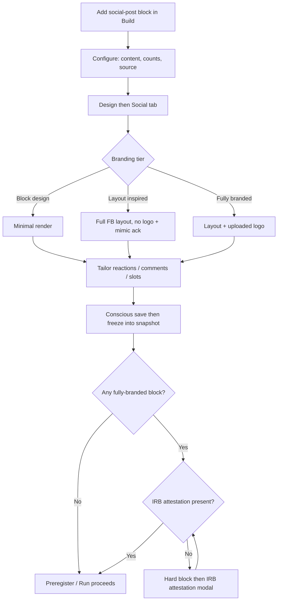

# User flow — Build social-post stimuli

- **Job-to-be-done:** [build-a-study](../jobs-to-be-done/build-a-study.md)
- **Primary persona:** [postdoc-operator](../personas/postdoc-operator.md)
- **Secondary personas (if any):** [principal-investigator](../personas/principal-investigator.md) (signs off on the IRB attestation)
- **Grounding insights:** [researcher-tooling-pain-points](../../01_research/insights/researcher-tooling-pain-points.md)
- **Status:** draft

## Goal

> One sentence: what the user is trying to accomplish.

Recreate a realistic social-media post (Facebook in v1) as a study stimulus — its layout, reactions, comments, and interactions — at the fidelity the study needs, without exposing the platform (or us) to trademark risk.

## Preconditions

- Signed in; member of the workspace with **write** role (tip/owner per ADR-0011 roles).
- A study exists with at least one `social-post` block added in **Build**.
- The study is editable (a Draft working copy — not a frozen preregistered version being viewed read-only).

## Postconditions

- The `social-post` block(s) carry the chosen **branding tier**, layout, reaction set, comment thread, and any **custom slots**, frozen into the version snapshot on the next conscious save.
- If any block is **fully branded**, the study carries a recorded **IRB attestation**; otherwise the study has no attestation and is unaffected.
- The Design → Social preview reflects exactly what a participant will see in `/take`.

## Happy path

> Each step names the system response and the next decision point.

1. In **Build**, the researcher adds a `social-post` block and fills its content in the **Configure** panel — headline/body/source/image, seeded counts, author handle, veracity ground-truth (existing v2 fields). (Trigger: block selected.)
2. The researcher opens **Design → Social** (new sub-tab beside Theme · Chat). System shows a controls column + a **live Facebook-post preview** that re-renders on every change.
3. The researcher picks a **branding tier** (default inherited from the study-level Design default): `Block design` → `Layout (inspired, no logo)` → `Fully branded`. (Decision point — see Branches.)
4. The researcher tailors the **layout & interactions**: which reactions are available (the seven: Like/Love/Care/Haha/Wow/Sad/Angry), whether the reaction picker is *live/measured* or display-only, reaction summary + counts, the action bar (React/Comment/Share), and the comments thread (top-fan, seeded comments, nested replies, per-comment reactions, "View more comments", "N of M"). System validates and live-previews each change; autosaves via `studies.setSocialPostDesign` (rides `theme`/snapshot, ADR-0024 pattern).
5. The researcher optionally adds **custom slots** — researcher-defined elements (text/image/icon) dropped into named regions (header badge, sponsored label, below-body CTA, pinned comment). System renders them in the preview.
6. The researcher relabels native copy if desired (existing Wording editor — Like/Share/Comment/placeholder).
7. The researcher saves a version (conscious save → version bump). System freezes the design into the snapshot; the Run/Preregister preflight runs the **branding/IRB gate** (see Branches).

## Branches and decision points

- **Decision: branding tier (step 3).**
  - **Path A — Block design:** minimal render (current default). No frame, no chrome, no logo. Continues at step 4 (most interaction controls hidden — there's no platform layout to tailor).
  - **Path B — Layout (inspired):** full Facebook layout (chrome, reactions, comments) with **no logo** and a clear "inspired by" indication; requires the existing **mimic acknowledgment** checkbox (ADR-0024). Continues at step 4.
  - **Path C — Fully branded:** Path B **plus a researcher-uploaded logo/marks** (presign → R2, ADR-0003). Adds a precondition for publishing: the **IRB attestation** (see failure modes). Continues at step 4.
- **Decision: study-level default vs per-block override (step 3).** The Design → Social tab sets a **study default tier**; an individual block may override it in its Configure panel. Effective tier = block override ?? study default.
- **Decision: live vs display-only interactions (step 4).** If live, the reaction/comment/share become measured response fields (existing `social-post` response schema, extended for chosen-reaction); if display-only, they render but collect nothing.

## Failure modes

- **Trigger:** the study has a fully-branded block but no IRB attestation, and the researcher hits **Preregister / Make-live / Run**.
  - **System response:** **hard block** (PRECONDITION_FAILED) with an inline explainer + a link to the IRB attestation modal; nothing is published.
  - **Recovery:** the researcher (or a PI) confirms the attestation modal (states IRB approval covers branded-stimulus use); the attestation is recorded in the snapshot + audit trail; the action can proceed.
- **Trigger:** fully-branded selected but no logo uploaded.
  - **System response:** the tier can be selected but the preview shows a "logo required" placeholder; the publish gate also fails until a logo is present.
  - **Recovery:** upload a logo (or pick from Materials), or drop to Layout tier.
- **Trigger:** logo asset deleted from Materials (orphaned key).
  - **System response:** render falls back to the no-logo Layout treatment (orphan-safe); preflight flags it.
  - **Recovery:** re-upload / re-pick.
- **Trigger:** autosave (`setSocialPostDesign`) fails.
  - **System response:** shared autosave-error treatment (used by Theme/Chat tabs).
  - **Recovery:** retry; local edits preserved.

## Out of scope

- X and TikTok builders (deferred to later PRs; this flow is **Facebook v1**). The data model and renderer dispatch are designed to extend, but the controls and preview here cover Facebook only.
- Authoring brand-new presets / arbitrary CSS (presets remain vetted code — ADR-0024).
- Shipping any trademarked logo (we never ship them — fully-branded marks are researcher-uploaded). See the branding-tiers ADR.
- Participant-side rendering specifics — covered by the take runtime (ADR-0013) + the renderer override contract (ADR-0024).

## Open questions

- Should the IRB attestation be **study-level** (one attestation covers all branded blocks — assumed) or **per-block**? (Assumed study-level for v1; revisit if reviewers want block-granular evidence.)
- Should "Care" / newer reactions be on by default or opt-in per study? (Assumed: full seven available, researcher curates.)
- Do we auto-inject the branding tier into the Overview methodology (like ADR-0024's `applyVisualContext`)? (Assumed yes for Layout/Fully-branded.)

## Diagram

> Embed or link the flow diagram (Mermaid, Figma, or whiteboard export).

