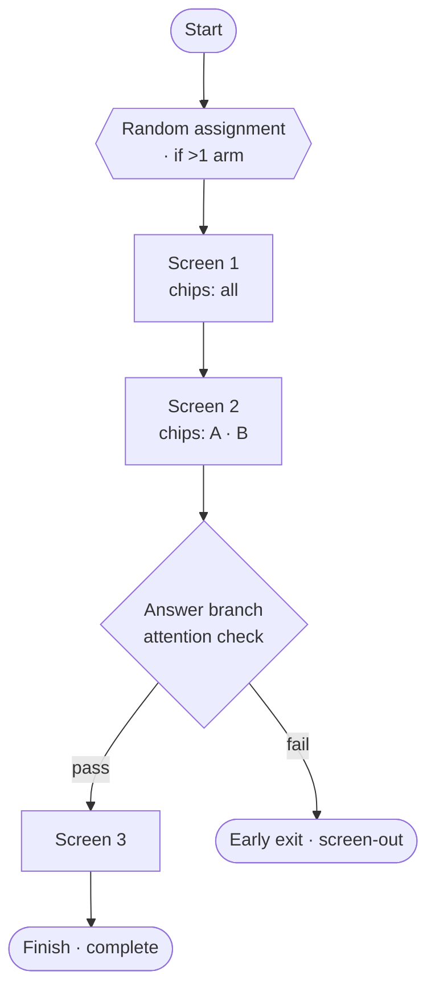

# User flow — Build a study as a flow

- **Job-to-be-done:** [Build a study](../jobs-to-be-done/build-a-study.md)
- **Primary persona:** [Postdoc operator](../personas/postdoc-operator.md)
- **Secondary personas (if any):** [Principal investigator](../personas/principal-investigator.md)
- **Grounding insights:** [Researcher tooling pain points](../../01_research/insights/researcher-tooling-pain-points.md)
- **Status:** draft

## Goal

> One sentence: what the user is trying to accomplish.

Build, understand, and navigate a study as an accurate visual diagram of how a participant actually moves through it — start to finish, including branches and arms — while watching the participant experience update live as they edit.

## Preconditions

> What must be true before the flow begins. (Signed in, has at least one project, etc.)

- Signed in, an active member of the workspace with a write role (owner/admin/editor).
- A study exists and its **draft tip** is open in the Build stage (the flow diagram and the live preview both operate on the editable draft, never a frozen version).

## Postconditions

> What is true after the flow completes successfully.

- The study's blocks/screens, answer-based branches, arm visibility, and terminals are edited as intended, autosaved to the draft tip.
- The flow diagram faithfully reflects the **real run order** (Start → ordered screens → inline branches → one or more terminals), so the researcher can read and trust it.
- The researcher has previewed the participant experience for the current draft without leaving the Builder.

## Happy path

> Each step names the system response and the next decision point.

1. The researcher opens the Build stage and switches to the **Flow** view. (System: renders the diagram **derived** from the study structure — a fixed **Start**, the ordered spine of screens, any inline branch nodes, and the terminal node(s); auto-laid-out, no free placement.)
2. They read the flow top-to-bottom to orient. Each screen shows which **arms** see it (chips by default). If the study has more than one arm, a **Random assignment** node sits right after Start.
3. They click a screen node. (System: selects it and opens its settings in the right config panel — block config, arm visibility, branch logic.)
4. They press a **`+` insert point** between two steps and add a block. (System: inserts it at that position in the real order; the diagram re-lays-out.)
5. They add an **answer-based branch** on an earlier block's answer (e.g. "if attention check ≠ correct"). (System: writes the `showIf` rule; the diagram draws a labeled if/else fork that rejoins the spine — or routes to a terminal.)
6. They route the "failed" arm to an **early-exit terminal** (screen-out). (System: the branch points to an end-redirect/early end; the diagram shows a second terminal node.)
7. They open the **live preview** pane beside the editor and edit a question's wording. (System: the preview re-runs the real runtime on a debounce and refreshes, **holding the current screen** so they stay where they were.)
8. They toggle the arm view from **Chips** to **Swimlanes** to read one arm's literal path end-to-end, then back. (System: re-renders the same flow in the chosen representation.)
9. Done — everything is autosaved to the draft; no explicit save needed.

## Branches and decision points

> For each non-trivial branch.

- **Arm representation.** Default **Chips on one spine**; the researcher can **toggle to Swimlanes** (one lane per arm). Same underlying study, two readings.
- **Answer-based branch (`showIf`).** A screen is shown or skipped based on an earlier answer — drawn as a true if/else fork that rejoins the spine, or routes to a terminal.
- **Terminals.** The normal **Finish** (study complete) plus any **early-exit** terminals (screen-out / end-redirect) reached by a branch. A study may have more than one terminal.
- **Diagram vs list.** The Flow view and the list Builder are two views of the **same** study; edits in either sync both ways via the same mutations.

## Failure modes

> For each plausible failure.

- **Forward-referencing branch.** A `showIf` clause references a block that now comes *later* (e.g. after a reorder). System: the runtime already ignores forward clauses; the diagram marks the branch **invalid** with a fix hint. Recovery: reorder or repoint the clause.
- **Unreachable screen.** A screen no arm/branch can ever reach. System: a **warning badge** on the node. Recovery: adjust arm visibility / branch logic.
- **Preview runtime error.** The draft can't run (e.g. a misconfigured block). System: the preview pane shows the error + a **Restart**; the editor stays usable. Recovery: fix the block; preview refreshes.

## Out of scope

> What this flow deliberately does not cover, and which other flow does.

- **Changing runtime semantics.** The engine stays *linear-with-conditional-visibility* (ADR-0021/0028); this flow visualizes and edits that model, it does not introduce arbitrary goto-style branching.
- **Multi-version compare** on the canvas (existing side-by-side compare, ADR-0020/A6) — unchanged.
- **The participant's own experience** — see [Participant: take a study](participant-take-a-study.md).
- **Running / recruiting / results** — separate stages.

## Open questions

> Anything we are unsure about.

- Swimlane density when a screen is shared by many arms (repeat the node per lane vs span lanes) — to settle in the wireframe.
- Whether the live preview refreshes on every debounced keystroke or on autosave commit — wireframe decision; default to debounced-on-change with position held.

## Diagram

