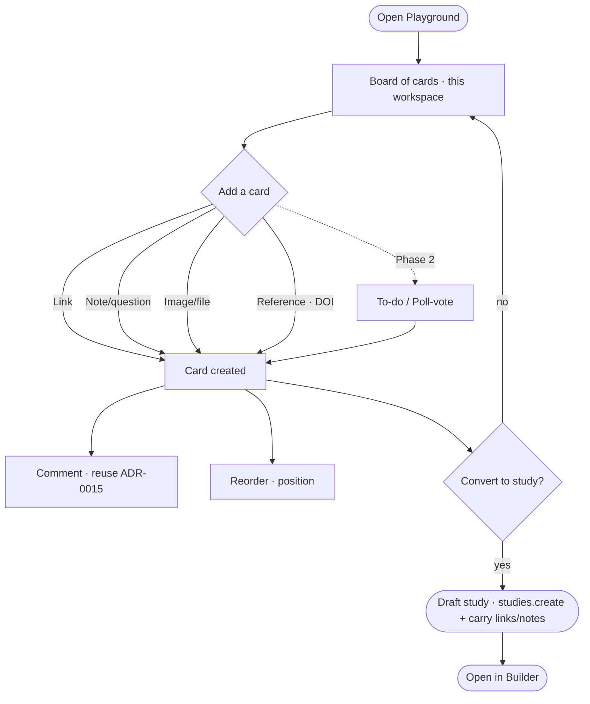

# User flow — Collect inspiration in the Playground

- **Job-to-be-done:** [Build a study](../jobs-to-be-done/build-a-study.md) (the pre-build "momentum needs a place to land" force); touches [Get set up](../jobs-to-be-done/get-set-up.md) for the collaborative-workspace angle.
- **Primary persona:** [Postdoc operator](../personas/postdoc-operator.md)
- **Secondary personas (if any):** [Principal investigator](../personas/principal-investigator.md) (reviews, comments, votes; rarely builds)
- **Grounding insights:** [researcher-tooling-pain-points](../../01_research/insights/researcher-tooling-pain-points.md) (the "switching wins a group, not a person" finding — a shared pre-build space is group-shaped), [persona-segmentation-and-strategic-risks](../../01_research/insights/persona-segmentation-and-strategic-risks.md)
- **Status:** draft

## Goal

> One sentence: what the user is trying to accomplish.

Collect, discuss, and triage the raw inspiration and materials for a study-not-yet-built — links, notes/questions, images/files, and reference papers — in a shared workspace board, then convert the promising material into a draft study without re-keying it.

## Preconditions

> What must be true before the flow begins. (Signed in, has at least one project, etc.)

- Signed in, an active member of the workspace. **Read** is available to any member; **adding/editing cards and converting to a study** require a write role (owner/admin/editor), consistent with the workspace permission model used elsewhere. Commenting follows the existing comments permission rule (ADR-0015).
- A workspace exists. **No study is required** — that is the point of the Playground: it lives *before* a study, as a new workspace destination alongside Studies/Library/Frameworks (the left rail, ADR-0046 destination pattern).

## Postconditions

> What is true after the flow completes successfully.

- A Playground board holds the team's inspiration as typed **cards** (link / note / image / file / reference, and in Phase 2 to-do / poll), each comment-able, ordered by the team.
- Discussion lives **on the cards** via the existing comments system (ADR-0015) — no parallel thread store.
- Where the team decided to proceed, a card (or the board) has been **converted into a draft study** whose initial notes/links carry over, so the build starts from the gathered material rather than a blank canvas.

## Happy path

> Each step names the system response and the next decision point.

1. Hanna opens **Playground** from the left rail. (System: routes to the workspace Playground destination — the route group `(app)/(workspace)/playground` — and renders the board of cards for this workspace, newest-arranged, with an **Add** affordance. Empty workspace → empty state with the card-type choices.)
2. She pastes a URL into the **Add → Link** affordance. (System: creates a **link card** (`kind:"link"`, `url` set); a title is taken from the pasted text/URL — no server-side scraping in v1, see Open questions.)
3. She adds a **Note / question** card with a freeform thought ("Do we manipulate source or message? Park this until Maya weighs in"). (System: creates `kind:"note"` with `body` markdown.)
4. She adds an **image** of a competitor's stimulus via the existing uploader. (System: the existing `UploadButton` (`components/feature/builder/upload-button.tsx`) presigns + PUTs to media storage and returns a stable `/api/media` URL; an **image card** is created with `mediaKey` set. Reuses media infra, no new upload path.)
5. She adds a **Reference** by pasting a DOI. (System: `studyRecord.lookupCitation` resolves it through the Crossref `CitationAdapter` (`server/adapters/citation.ts` → `citation.crossref.ts`, the ADR-0007 vendor seam); a **reference card** is created with `refDoi` + resolved title/authors. Bad/unknown DOI → see Failure modes.)
6. The PI (Maya) opens the board and **comments** on the note card. (System: opens a comment thread on that card via the existing comments system — `commentsRouter`, the `comment` table with a new `targetType:"playground_card"` and `targetId` = card id; activity/notifications fire as for any comment, ADR-0015.)
7. The team **reorders** cards to cluster the "in" pile at the top by dragging. (System: persists `position` per card; the board re-renders in the new order.)
8. *(Phase 2)* Someone adds a **poll/vote** card ("Which framing do we test first?") and members **vote**; a **to-do** card ("Maya to send the 3 candidate stimuli") gets an assignee and a done checkbox. (System: votes + to-do state stored on/alongside the card; see ADR-0059 for the reuse decision.)
9. The team decides to proceed. Hanna picks a card (or selects several) and chooses **Convert to study**. (System: calls `studies.create`, then carries the source card's `url`/`body`/title (and selected siblings) into the new draft's initial notes/links; returns the new study id and offers to open it in the Builder. The source card is **linked, not deleted** — see Branches.)
10. Done — the Playground retains the full pre-build trail (decisions, rejected ideas, discussion); the new draft study starts pre-seeded.

## Branches and decision points

> For each non-trivial branch.

- **Which card type.** The **Add** affordance fans out to: Link · Note/question · Image/file · Reference. *(Phase 2 adds: To-do · Poll/vote.)* Each lands a card of the matching `kind`; the rest of the flow is identical.
- **Convert one card vs. several.** **Path A (single):** convert one card → its `url`/`body`/title seed the draft. **Path B (multi-select):** convert a selection → all selected cards' links/notes are carried into one draft's initial materials. Either way the draft is created via `studies.create` (no new study-creation path).
- **Keep or archive the source card after convert.** Default: **keep and link** the source card to the created study (so the board stays a record). Archiving the card is an explicit, separate action — convert is non-destructive.
- **Read-only member (viewer).** Path: they can open the board and read cards/comments; **Add / edit / reorder / convert** affordances are absent, and commenting follows the existing comment permission.

## Failure modes

> For each plausible failure.

- **DOI lookup fails / unknown DOI.** Trigger: Crossref returns nothing or errors. System: the reference card is **still created** with the raw DOI/identifier and a "couldn't resolve — retry" affordance; the failure does not block card creation. Recovery: re-run lookup or edit the card to a note. (Same adapter the study record already uses; no new failure surface.)
- **Media upload fails.** Trigger: presign/PUT error from the uploader. System: the existing `UploadButton` error path surfaces; no card is created until a `mediaKey`/URL exists. Recovery: retry the upload.
- **Convert-to-study fails partway.** Trigger: `studies.create` succeeds but carrying the card content errors. System: the draft exists but is under-seeded; we surface "study created, but couldn't carry everything — open it / retry copy" rather than silently dropping material. Recovery: retry the copy, or paste manually. (Avoids the persona's "copying my design from one box to another" dread — but never claims a clean carry it didn't do.)
- **Permission lost mid-session (role downgraded).** Trigger: a write action after a role change. System: the mutation is rejected by the same write-gate used elsewhere; the board falls back to read-only with an explanatory toast. Recovery: ask an admin.

## Out of scope

> What this flow deliberately does not cover, and which other flow does.

- **Building the study itself** — once converted, the user is in the Builder; see [Build a study as a flow](build-study-as-a-flow.md).
- **Link unfurling / OG-image scraping** for link cards — deliberately deferred (a server-side fetch is a new vendor/PII surface); titles come from the pasted text in v1.
- **Preregistration / OSF push** of Playground material — the Playground is pre-study working space, not an end-of-project archive; OSF stays a Study Record concern (ADR-0005).
- **Cross-workspace boards / templates** — a board belongs to one workspace; no sharing across workspaces in v1 (cf. ADR-0018 for the forking model that does cross workspaces, intentionally not reused here).

## Open questions

> Anything we are unsure about.

- **Link card titles** — paste-text only in v1, or a (deferred) server-side unfurl behind the adapter seam later? @owner. Default: paste-text only.
- **Convert granularity** — does multi-select convert produce one draft or offer one-draft-per-card? Default to one draft; revisit if teams ask. @product.
- **Phase 2 votes storage** — reuse a generic reaction/vote table vs. a dedicated `playground_vote` — settled in ADR-0059's data-model sketch; confirm against any reaction primitive that lands first.

## Diagram

