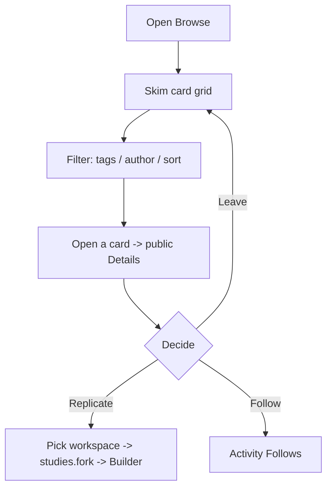

# User flow — Discover and replicate public studies

- **Job-to-be-done:** [Build a study](../jobs-to-be-done/build-a-study.md)
- **Primary persona:** [Sofia — burned replicator](../personas/burned-replicator.md)
- **Secondary personas (if any):** [Hanna Kowalczyk — postdoc operator](../personas/postdoc-operator.md) (the author whose public study is discovered)
- **Grounding insights:** [persona-segmentation-and-strategic-risks](../../01_research/insights/persona-segmentation-and-strategic-risks.md), [researcher-tooling-pain-points](../../01_research/insights/researcher-tooling-pain-points.md)
- **Status:** draft

## Goal

A researcher finds someone else's publicly-shared study — without already knowing its id or having a link — and replicates it into their own workspace to run or adapt.

## Preconditions

- Signed in, inside a workspace (the Browse listing is public-readable, but Replicate needs a destination workspace).
- At least one study exists with `forkable_by = 'public'` and a `published` or `preregistered` version (the discoverable set). Until then Browse shows its empty state.

## Postconditions

- The user has either replicated a public study (a cross-workspace fork now exists in their workspace and they land in its Builder), followed an author/tag, or left Browse — state persists.
- The source study is unchanged; its author sees the replication in Activity·Follows (ADR-0015).

## Happy path

1. **Open Browse** from the destination switcher (Studies / Library / Frameworks / Activity / Browse). (Trigger: wants to see what others have shared.)
2. **Skim the card grid.** Each card: study title (Plex Serif), author byline (+Follow), tag chips, "published/preregistered vN" marker, replication count.
3. **Narrow with filters** (left sidebar): tag multiselect (autocomplete), author search, and a sort toggle (Most recent / Most replicated).
4. **Open a card** to read the study's public Details — a read-only view of the latest published/preregistered version's blocks.
5. **Replicate.** Click `Replicate`; if the user has more than one workspace, pick the destination. A cross-workspace fork is created (ADR-0018) and the user lands in the new fork's Builder.

## Branches and decision points

### Decision 1 (step 5) — replicate, follow, or leave

- **Decision:** the study fits a replication/adaptation need (replicate), is interesting for later (follow the author or a tag), or isn't a fit (keep browsing).
- **Path A — Replicate:** `studies.fork` (existing) → redirect to the fork's Builder; activity event emitted to the source author's followers.
- **Path B — Follow:** +Follow on the author byline or a tag chip (reuses V1.7 follow affordances) → appears in Activity·Follows.
- **Path C — Leave:** no commitment; filters + scroll position are ephemeral.

## Failure modes

- **No public studies match the filters** — empty state: "No public studies match those filters yet — try a broader search, or browse all."
- **Source becomes non-public between listing and replicate** — the fork mutation rejects (the existing public-or-member guard in `studies.fork`); show a clear toast and refresh the card.
- **Single-workspace user** — no destination prompt; replicate goes straight into the only workspace.

## Out of scope

- **Filter by framework** (deferred — the schema doesn't persist study→framework provenance yet; see the wireframe's "Why not" note).
- **Full-text search** (V1.8 Browse is faceted filters only; full-text needs a separate search-infra ADR).
- **Saved-search / follow-a-search** (deferred to a later release).

## Open questions

- "Most replicated" sort counts all forks regardless of the fork's own visibility — confirmed acceptable (the count is a popularity signal, not a list of forks).

## Diagram

## Sources

- ADR-0018 — cross-workspace forking (the Replicate data layer).
- ADR-0002 — forking model + `forkable_by` visibility.
- ADR-0015 — activity events (the replication shows in the author's Follows feed).
- ADR-0017 — study-level tags (the tag filter source).
- Brief v0.6 — destination chrome (slim top bar + card grid + filter sidebar).
