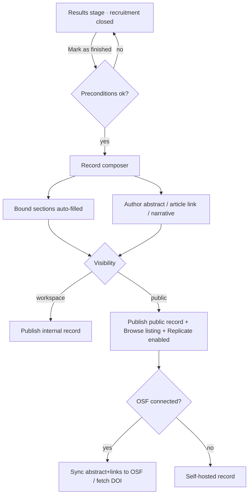

# User flow — Finish a study and publish its record

- **Job-to-be-done:** [Build a study](../jobs-to-be-done/build-a-study.md)
- **Primary persona:** [Hanna Kowalczyk — postdoc operator](../personas/postdoc-operator.md) (the author finishing the study)
- **Secondary personas (if any):** [Sofia — burned replicator](../personas/burned-replicator.md) (the reader who later discovers + replicates the record)
- **Grounding insights:** [finished-studies-and-comparable-discovery](../../01_research/insights/finished-studies-and-comparable-discovery.md), [researcher-tooling-pain-points](../../01_research/insights/researcher-tooling-pain-points.md)
- **Status:** draft

## Goal

Turn a study whose data collection is complete into a **Study Record** — a structured, citable, optionally-public page (abstract, method, results, data pointer, links) — and in doing so make it correctly discoverable and replicable.

## Preconditions

- Signed in; an active member of the study's workspace with write access.
- The study has at least one frozen version (preregistered or published) and a recruitment session that is **closed/stopped** with at least one completed response (there is something to report).

## Postconditions

- The study has lifecycle state **Finished** (`finishedAt` set; recorded who finished it).
- A Study Record exists for the study (auto-composed from bound sections at minimum).
- If the author opted the study public-replicable, the Record is **public** at a stable URL and appears in Browse landing on the Record (not the Builder).
- **Replicate** is now enabled for others; **Use as template** remains available regardless.
- Followers of the study/author/tags receive a "finished / published a record" activity entry.

## Happy path

1. The author finishes data collection and closes recruitment, then opens the **Results** stage. (Trigger: recruitment stopped.)
2. A primary CTA appears: **"Mark study as finished."** System checks preconditions (closed recruitment + ≥1 completed response); on pass, it opens the **Record composer**.
3. The composer pre-fills **bound sections** from existing data — Method (overview + protocol blocks + conditions), Preregistration (frozen snapshot + OSF DOI if present), Results (key figures from the results data), Replications (lineage), Materials (link to the participant Preview). The author cannot break these; they can reorder/show/hide.
4. The author fills **authored sections** — Abstract (required to publish public), Results narrative, **Article link / DOI**, optionally **Deviations** (what departed from the plan, and why), and any custom content blocks — by drag-and-drop from a section palette.
4a. **The author links each reported claim back to the plan** (ADR-0102). On every Hypotheses section a **"Tests"** select lists the hypotheses of the study's newest preregistration as `H1…Hn`. Picking one binds the claim to that frozen hypothesis and the record renders a **Preregistered** chip naming its referent ("H2 of the preregistration filed 2026-05-01, v3"); leaving it at `—` renders **Exploratory**. A bound claim can be reported as exploratory anyway (a planned hypothesis analysed a way the plan didn't specify). The author **cannot** mark a claim preregistered without binding it — the word is earned by pointing at a frozen hypothesis, not by asserting it. On a study with no preregistration the control is absent and every claim reads Exploratory.
5. The author chooses **visibility** (workspace-only, or public — only offered if the study is already public-replicable or they opt in here) and clicks **Publish record**.
6. System sets `finishedAt`, persists the Record layout, emits a `study_finished` activity event, and (if public) exposes the Record URL + lists it in Browse. Replicate is enabled.
7. Confirmation: a link to the live Record + "Copy citation" + (if connected) "Sync to OSF."

## Branches and decision points

- **Decision: visibility.** Public → Record is discoverable + Replicate enabled for others. Workspace-only → Record exists internally; not in Browse; Replicate still requires public per ADR-0018.
- **Decision: OSF sync (if connected).** Yes → push abstract + links + results summary to the OSF project, and fetch back the article DOI if present (continues at step 7 with a synced badge). No → Record is self-hosted only.
- **Decision: edit later.** The author can reopen the composer any time (Record is editable); finishing is not destructive. Re-publishing updates the live Record.
- **Decision: bind each claim, or not** (ADR-0102). Bound → the claim reads **Preregistered** and cites the frozen hypothesis it tests. Unbound → **Exploratory**, which is the honest default, not a penalty. Bound-but-reported-exploratory → **Exploratory**. There is no fourth option: the record cannot claim preregistration it can't evidence.

## Failure modes

- **Trigger:** recruitment not closed / no completed responses. **System response:** "Mark as finished" is disabled with a tooltip ("Close recruitment and collect at least one response first"). **Recovery:** finish recruitment, return.
- **Trigger:** publish public without an abstract. **System response:** inline validation on the Abstract section ("An abstract is required to publish a public record"). **Recovery:** fill it or switch to workspace-only.
- **Trigger:** OSF sync fails (token expired / API error). **System response:** the Record still publishes; a non-blocking banner "Couldn't sync to OSF — [reason]; retry." **Recovery:** reconnect OSF (ties to the deferred OSF-OAuth refresh work) and retry sync.
- **Trigger:** study later amended / reopened for more data. **System response:** Record shows a "superseded — newer version exists" note; finishing again refreshes it. The **amendment history renders publicly** on the Record (ADR-0102) — each filing with its change summary and author-classified reason; it cannot be reordered or hidden (ADR-0004).
- **Trigger:** the author binds a claim, then amends the plan so the hypothesis renumbers. **System response:** none needed — the binding pins the *version*, and a frozen version's hypothesis list can never renumber, so the claim keeps citing exactly what it was bound to (and the render names that version).
- **Trigger:** a record published before ADR-0102 is reopened. **System response:** its claims have no bindings, so they read **Exploratory**. Accepted cost — the system genuinely cannot verify them. **Recovery:** the author binds them and the chips flip; there is deliberately no "mark all preregistered" shortcut.

## Out of scope

- The exact catalogue of composer section types + their data bindings — see the wireframe [study-record](../../03_design/wireframes/study-record.md) and ADR-0054.
- Discovery mechanics (search, filters, the Browse landing) — see ADR-0055 and the updated [browse-public-studies](../../03_design/wireframes/browse-public-studies.md) wireframe.
- The exact OSF endpoints for wiki/metadata/related-identifiers — must be verified against live docs before build (ADR-0054 §OSF).

## Open questions

- Should "Finished" be reversible to "running" (reopen for more data), or only forward to a new amended version? (Owner.)
- Minimum data to expose publicly under the PII boundary — aggregate only; confirm which result fields are safe by default. (Owner + ADR-0014.)
- Does finishing auto-close any still-open recruitment, or require it closed first? (Recommend require closed.)

## Diagram

