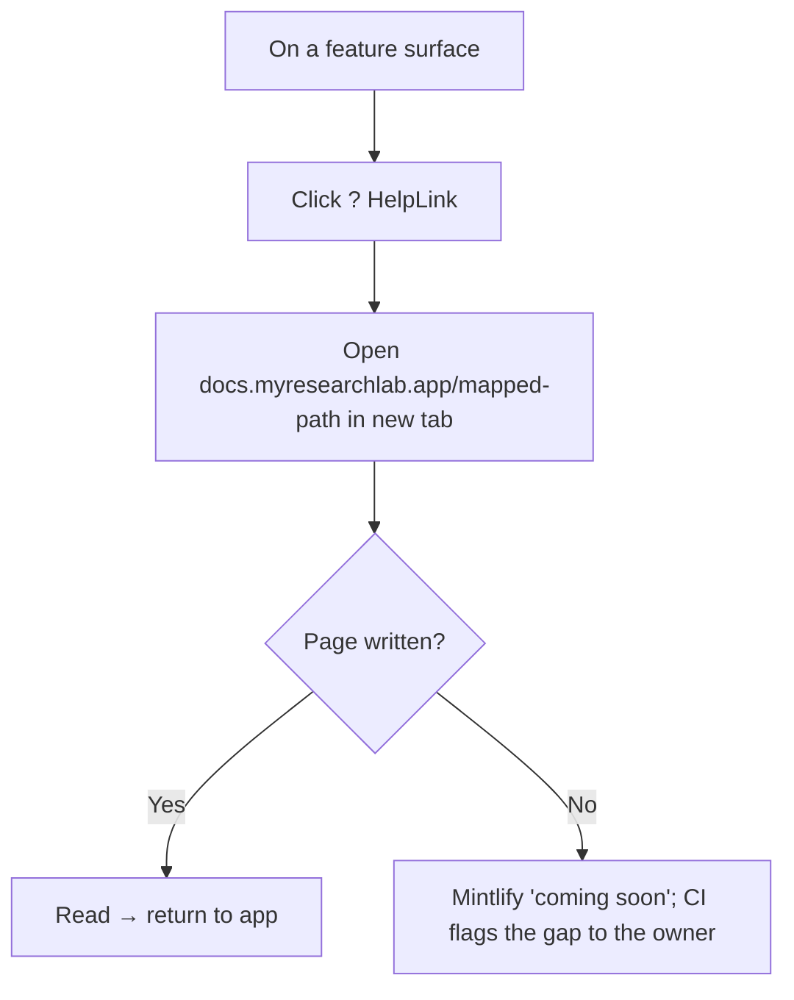

# User flow — Get help from docs (contextual)

- **Job-to-be-done:** [Get set up](../jobs-to-be-done/get-set-up.md)
- **Primary persona:** [Postdoc operator](../personas/postdoc-operator.md)
- **Secondary personas (if any):** [Burned replicator](../personas/burned-replicator.md), [Principal investigator](../personas/principal-investigator.md)
- **Grounding insights:** [Researcher tooling pain points](../../01_research/insights/researcher-tooling-pain-points.md)
- **Status:** draft

## Goal

> One sentence: what the user is trying to accomplish.

Get an answer to "how does this part of the app work?" without leaving their task — a one-click jump from the feature they're on to the exact doc page that explains it.

## Preconditions

> What must be true before the flow begins.

- The researcher is on a feature surface (Builder, an integration card, a methodology step) that carries a contextual help affordance (a `?` `<HelpLink>`).
- The docs site (`docs.myresearchlab.app`) is reachable.

## Postconditions

> What is true after the flow completes successfully.

- The relevant doc page opens in a new tab; the researcher's in-app work is untouched.

## Happy path

> Each step names the system response and the next decision point.

1. The researcher hits a question on a feature ("what's a condition?"). (Trigger: uncertainty mid-task.)
2. They click the `?` help link next to the feature's heading/control.
3. The system opens `docs.myresearchlab.app/<mapped-path>` in a new tab (the `DOC_URLS[docKey]` mapping).
4. They read, then return to the still-open app tab and continue.

## Branches and decision points

> For each non-trivial branch.

- **Decision:** the mapped doc page exists yet or not.
  - **Path A (written):** the page renders.
  - **Path B (not written):** Mintlify shows a "coming soon" placeholder rather than a 404; a build-time CI check flags which `DOC_URLS` entries lack a live page so the gap is visible to the owner, not the researcher.

## Failure modes

> For each plausible failure.

- **Trigger:** docs host unreachable. **System response:** the link is a normal `<a target="_blank">` — the browser shows its own error; the app is unaffected. **Recovery:** retry / the app keeps working.
- **Trigger:** a `docKey` typo. **System response:** prevented at compile time — `docKey` is a typed union, so an unknown key won't build.

## Out of scope

> What this flow deliberately does not cover, and which other flow does.

- In-app announcements (PF4) and the product tour (PF3) — separate help surfaces; docs are reference, not onboarding nudges.
- Authoring the docs content (owner/LLM content track), and the Mintlify hosting setup itself (one-time, ADR-0078).

## Open questions

> Anything we are unsure about.

- Whether to also surface a global "Help / Docs" entry (e.g. in the user menu) in addition to the contextual `?` links. — default: yes, a single top-level Docs link; contextual links are the primary affordance.

## Diagram

