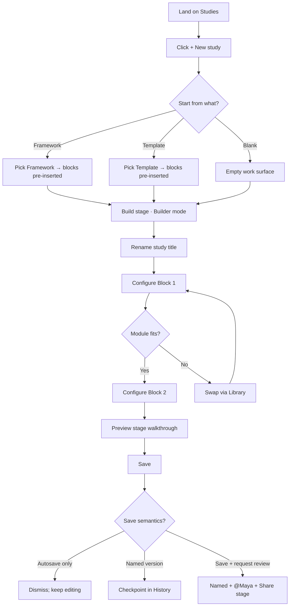

# User flow — Hanna build a study

- **Job-to-be-done:** [Build a study](../jobs-to-be-done/build-a-study.md)
- **Primary persona:** [Hanna Kowalczyk — postdoc operator](../personas/postdoc-operator.md)
- **Secondary personas (if any):** [Maya Okonkwo — PI](../personas/principal-investigator.md) appears as the reviewer Hanna saves for; she does not act in this flow.
- **Grounding insights:** [researcher-tooling-pain-points](../../01_research/insights/researcher-tooling-pain-points.md), [persona-segmentation-and-strategic-risks](../../01_research/insights/persona-segmentation-and-strategic-risks.md)
- **Status:** draft

## Goal

Hanna creates a new study draft, configures at least one validated block, and leaves it in a state where she can return tomorrow without losing work and Maya can review it without confusion.

## Preconditions

- Hanna is signed in to a workspace where she has author permission (per ADR-0007 multi-tenancy).
- The workspace has at least one Framework available (Misinformation Research Framework is the V1 launch theme per the design-language brief), and/or Hanna's personal Templates exist in Library.
- The workspace has at least one core module published (per ADR-0001 module registry).

## Postconditions

- A new study exists in the workspace, visible in the Studies destination's `Mine` sub-nav (also `All studies` and `Drafts`).
- The study has at least one named `ExperimentVersion` checkpoint (`kind: named`) plus the latest `autosave` version (per ADR-0002 immutable versions).
- The study has at least one configured `ModuleInstance` whose schema validation status is `passing` (or `flagged` with the failure visible in the right context panel — never silently `error`).
- The right context panel `Details` tab shows correct metadata: owner (Hanna), tags, replicating-of-link if applicable, last-edited timestamp.
- Closing the browser does not lose work; reopening Studies → Drafts returns Hanna to the same draft state.

## Happy path

1. **Land on Studies.** (Trigger: Hanna opens the app from a bookmark; the app defaults to the Studies destination because that's the most-used destination per IA v0.3.) The left rail shows Studies highlighted; the work surface shows her workspace's Studies list (Mine sub-nav). Top bar breadcrumb reads `Misinformation Lab · Studies`.
2. **Open the New study entry point.** (Trigger: Hanna clicks the `+ New study` button in the work surface header, or hits `⌘N`.) A modal opens asking how she wants to start. Three choices: `From a Framework`, `From a Template`, `Blank`. Continues at decision point §1.
3. **Pick "From a Framework" and select one.** A Framework picker surface inside the modal: search at top, browse below, filter by theme tag. She selects "Misinformation Research Framework." Modal dismisses. The system creates an `Experiment` with `forkable_by: workspace`, initializes the first `ExperimentVersion (kind: autosave)` from the Framework's recommended starter (per ADR-0001 + ADR-0002), and routes her to the new study's URL `/studies/{id}/build`.
4. **Land in Builder mode on Build stage.** Stage tabs show six (`Build · Preview · Share · Preregister · Run · Results`) with `Build` active. Work surface shows the study with a draft title ("Untitled study") and the Framework's recommended blocks already inserted with a small `surface.subtle` banner: "Starting from Misinformation Research Framework — you can remove any block you don't need." Right context panel opens to `Details` (study metadata: status=draft, owner=Hanna, framework=Misinformation Research Framework, last-edited=just now).
5. **Rename the study.** (Trigger: Hanna clicks the title in the work surface and edits.) On blur, the title autosaves into a new `ExperimentVersion (kind: autosave)`. Breadcrumb updates: `Misinformation Lab · Studies · Source cues replication v2`.
6. **Configure Block 1 (Stimulus presentation).** (Trigger: Hanna clicks Block 1 in the work surface.) Right context panel switches to `Configure` tab for the selected `ModuleInstance`. She uploads stimuli or links external assets (per ADR-0003 asset storage). Schema validation runs on every change. On success, the block's status badge in the work surface flips to `schema valid` (vibrant emerald per palette v0.5.1). Decision point §2 may apply here.
7. **Configure Block 2 (Manipulation check).** Right context panel shows a missing-field warning (`reverse_scored` not set). Hanna sets the field. Badge flips to `schema valid`.
8. **Switch to Preview stage.** (Trigger: Hanna clicks the `Preview` stage tab.) Work surface renders the study as a participant would see it; she steps through. No data collected. She returns to `Build`.
9. **Save as a named version.** (Trigger: Hanna clicks `Save` in the top bar.) A small dialog asks: `Continue autosaving` / `Save as named version` / `Save and request review`. She picks `Save as named version`, enters "v1 draft for review," confirms. The system writes a new `ExperimentVersion (kind: named)` with her label. Continues at decision point §3.
10. **Close the tab.** State persists. Returning tomorrow via Studies → Drafts opens her at the same state.

System responses are not optional polish: each save reflects in the right context panel's `History` tab immediately, and the `Details` tab's last-edited timestamp updates within one frame.

## Branches and decision points

### Decision 1 (step 2) — start from what?

- **Decision:** which seed does the new study use?
- **Path A — Framework:** the structured choice. Continues at step 3 with the Framework's recommended blocks pre-inserted and the study's `Details` tab showing `framework: <name>@<version>`. This is the default-virtue path per ADR-0009 — picking a Framework yields a better-documented study with no extra work.
- **Path B — Template:** Hanna picks one of her own saved templates or a public template from Library. Continues at step 3 substituting the template's structure for the Framework's. `Details` tab shows `template: <slug>@<version>`; no Framework binding.
- **Path C — Blank:** continues at step 4 with no blocks pre-inserted. Work surface shows an empty work area with a single `+ Add block` prompt at the center. Right context panel still shows `Details` but with no Framework or template binding.

### Decision 2 (step 6) — module fits or needs swap?

- **Decision:** does the inserted `ModuleInstance` cover what Hanna needs?
- **Path A — Fits:** configure inline; continue at step 7.
- **Path B — Doesn't fit:** Hanna opens the Library picker from the `Configure` tab (`Change module`). Picks a different module. The system runs a schema-compatibility check against upstream blocks (if any expect a specific output shape from this block). If compatible, swap silently; if not, show a per-field diff modal and require confirmation (per ADR-0001 schemas-first principle). Continue at step 6 with the new module.

### Decision 3 (step 9) — which save?

- **Decision:** what saving semantics does Hanna want right now?
- **Path A — Continue autosaving:** dismiss the dialog; nothing additional happens. No checkpoint in `History`. Autosave continues on every change.
- **Path B — Save as named version:** creates an `ExperimentVersion (kind: named)` checkpoint in `History`. Recommended before sharing with Maya so the review is anchored to a specific snapshot.
- **Path C — Save and request review:** creates a named version AND posts a `@Maya` mention into the Comments thread (per IA v0.3 comments-on-both-surfaces). System routes Hanna to the `Share` stage tab. Maya receives an entry in her Activity → Yours sub-stream.

## Failure modes

- **Network drops mid-edit.**
  - **Trigger:** Hanna's connection fails between autosaves.
  - **System response:** top bar shows an `Offline — changes saved locally` banner in `color.warning.subtle` with the warning amber dot. Autosave queues to `localStorage`. Editing continues. On reconnect, the queue flushes in order. If a conflict surfaces (rare for solo authoring, possible if she's also editing in another tab), the system shows a per-block diff modal and asks Hanna to pick.
  - **Recovery:** automatic on reconnect for non-conflicting changes; explicit choice in the conflict modal otherwise.
- **Saving a named version while validation is failing.**
  - **Trigger:** Hanna clicks Save → Save as named version, but Block N has a schema error.
  - **System response:** Save dialog shows `2 validation errors across 1 block — Block 2 (Manipulation check)` with a click-through that highlights the offending block. The `Save as named version` action is disabled; the `Continue autosaving` action remains available with a note "Autosaves don't require validation; named versions do." This is deliberate friction — named versions are the unit of peer review, so they should be reviewable.
  - **Recovery:** click the error to jump to the block; fix the field; retry Save.
- **Framework updated since Hanna started.**
  - **Trigger:** Hanna returns next day; the Misinformation Research Framework has a new version.
  - **System response:** `Details` tab shows a banner: `Misinformation Research Framework v1.3 → v1.4 — see what changed`. Per ADR-0001 module/Framework versions are pinned; updates are opt-in. The banner is informational, not blocking.
  - **Recovery:** Hanna clicks `See what changed` for a diff modal listing block additions, schema changes, and recommendation changes. She picks `Stay on v1.3` (default) or `Upgrade to v1.4` (which generates a new autosave version reflecting the upgrade and may require schema migration for any custom configurations).
- **Asset link upstream goes 404 before preregistration.**
  - **Trigger:** Hanna linked an external stimulus URL (per ADR-0003 hybrid asset storage) and the URL has gone dead.
  - **System response:** the asset's row in the right context panel shows `replication_risk: link_unreachable` with the danger red dot. Validation surfaces the issue but does not block autosave.
  - **Recovery:** re-link the asset or switch to internal upload. The Validation tab tells her this must resolve before she can preregister.
- **She tries to save as named version with an unsaved title edit pending.**
  - **Trigger:** Hanna is mid-edit on the title field and hits ⌘S.
  - **System response:** title field blurs (auto-commits the edit), autosave fires, then the Save dialog opens. No work lost.

## Out of scope

- **Whiteboard mode for this same study.** Hanna can toggle modes via the top-right `[ ⊞ Builder · ◇ Whiteboard ]` switch (per IA v0.3 and design-language brief v0.5.1). Whiteboard editing rules and the double-click-drops-to-Builder pattern are a separate flow.
- **Preregistration.** When Hanna decides the study is ready, she moves to the `Preregister` stage. That flow covers ADR-0004 amendments, ADR-0005 OSF push, ADR-0003 asset freeze.
- **Inviting Maya into the workspace.** Assumed precondition (workspace membership setup). Covered by a Team / member-management flow.
- **Running the study.** The `Run` stage and Hanna's recruitment / panel management flow live separately.
- **Hanna's first session ever (onboarding).** A new-workspace flow covers Framework picker first run, default settings, OSF connect prompt.

## Open questions

- **Modal vs full-page Framework picker (step 2).** A modal is faster (Linear-style command palette feel); a full-page surface gives the Framework picker more room to render reading-rich descriptions. **Recommendation:** modal in V1; if Frameworks grow into a serious browse experience, promote to full-page. Wireframes will reveal whether the modal's vertical real estate is enough.
- **Where autosave-vs-named-version education happens.** This is a foundational concept (per ADR-0002) and Hanna shouldn't have to read docs to discover it. **Recommendation:** first-run tooltip on the Save button explaining the three save semantics; reinforced by labels in the Save dialog.
- **When Framework recommended blocks appear — immediately or via an inserter wizard.** Either: blocks appear immediately with a "remove what you don't need" banner; or Hanna sees a `+ Insert Framework's recommended blocks` action and chooses. **Recommendation:** appear immediately. The Framework picker is itself the inserter choice; making her opt in twice is friction.
- **Conflict resolution UX for the localStorage queue.** Per-block diff modal is sketched; the actual UI shape needs a wireframe.
- **`Save and request review` UX overlap with the `Share` stage.** The action implicitly transitions stage; is that the right model, or should it just open a comments thread inline? **Recommendation:** transitions stage. The Share stage is the locked surface for review; treating "I want feedback" as a stage move keeps the lineage clean.

## Diagram

## Sources and traceability

- IA v0.3 — `03_design/ia/information-architecture.md` (Studies destination, stage tabs, right context panel structure).
- Design-language brief v0.5.1 — `03_design/design-language-brief.md` (modular surfaces, palette, validation badge treatments).
- ADR-0001 — module identity, schemas, theme overlays.
- ADR-0002 — immutable versions with kinds, forking semantics.
- ADR-0003 — asset storage hybrid, freeze on preregistration.
- ADR-0009 — default-virtue posture (Framework as the path-of-least-resistance to a better-documented study).
- Postdoc-operator persona — Hanna's daily-operator priorities, save-without-loss anxiety, Framework affinity.
