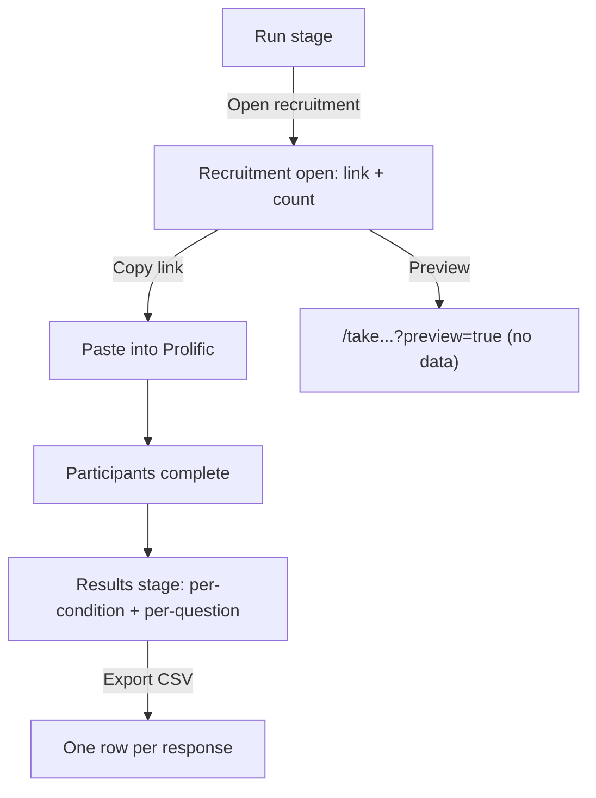

# User flow — Hanna runs and reads results

- **Job-to-be-done:** [Run a study and collect responses](../jobs-to-be-done/run-a-study.md)
- **Primary persona:** [Hanna Kowalczyk — postdoc operator](../personas/postdoc-operator.md)
- **Secondary personas (if any):** …
- **Grounding insights:** [researcher-tooling-pain-points](../../01_research/insights/researcher-tooling-pain-points.md)
- **Status:** draft

## Goal

Hanna takes her preregistered study live, shares the recruitment link, watches responses arrive, and reads per-condition results she can export — the researcher side of the participant runtime (the participant side is [Participant takes a study](participant-take-a-study.md)).

## Preconditions

- The study has a preregistered (immutable) version (ADR-0002/0005).
- Hanna is signed in with write permission in the workspace.

## Postconditions

- A `recruitment_session` (status `open`) exists for the preregistered version, with a shareable `/take/[studyId]/start` URL.
- As participants complete, `recruitment_session.current_n` and the Results aggregates reflect `mode='run'` responses (preview excluded by default).
- Hanna can read per-condition completion counts + per-question answer summaries and export a per-response CSV.

## Happy path

1. **Open the Run stage.** (Trigger: Hanna clicks the `Run` stage tab on a preregistered study.) The stage shows recruitment status. If not yet open, an **Open recruitment** action; if already open, the recruitment link + a live response count.
2. **Open recruitment.** (Trigger: clicks **Open recruitment**.) The server ensures ≥1 condition (a study with none runs as a single implicit `control`) and an open `recruitment_session`. The recruitment link and a **Preview** link appear.
3. **Preview.** (Trigger: clicks **Preview**.) Opens `/take/[studyId]/start?preview=true` in a new tab; Hanna walks the exact participant experience; nothing is recorded (a Preview ribbon makes this unmistakable).
4. **Share the link.** (Trigger: clicks **Copy**.) Hanna pastes the link into Prolific/CloudResearch (provider integration is V1.6 — V1.5 is copy-paste).
5. **Watch responses arrive.** Reloading the Run stage shows the rising completed count.
6. **Read results.** (Trigger: clicks the `Results` stage tab.) The stage shows per-condition completion counts and, per question, an answer summary (e.g. a 1–7 likert mean + n); a preview-included toggle (default off).
7. **Export.** (Trigger: clicks **Export CSV**.) Downloads one row per response with `response.id`, `condition.slug`, `external_pid`, `started_at`, `completed_at`, and one column per question block — the analysis hand-off (matches the PII boundary in ADR-0014).

## Branches and decision points

- **Not preregistered.** Run/Results both require a preregistered version; if none, the stage prompts Hanna to preregister first (no recruitment can open).
- **No responses yet.** Results shows an empty state ("No responses yet — share your recruitment link") rather than zeros that look like a bug.
- **Include preview responses.** A Results toggle; default excludes `mode='preview'` so debugging walk-throughs don't pollute real data.

## Failure modes

- **Open recruitment without preregistration.** Server rejects (PRECONDITION_FAILED); the UI shows the preregister prompt.
- **Export with zero responses.** Produces a header-only CSV (valid, not an error).

## Out of scope

- Pausing/closing recruitment and editing `target_n` — V1.6 (V1.5 opens and shares).
- Recruitment-provider integration (Prolific/CloudResearch as bookable services) — V1.6.
- Inferential statistics / significance testing — out of scope entirely; we export clean data for the researcher's own analysis.
- Per-participant drill-down beyond the CSV — V1.6.

## Open questions

- Which per-question summaries ship in V1.5: likert mean + n is the minimum; distribution bars are a nice-to-have. Leaning mean + n for V1.5.
- CSV column naming for multi-value blocks — V1.5 modules are single-answer, so one column per block; revisit when a module emits multiple values.

## Diagram

