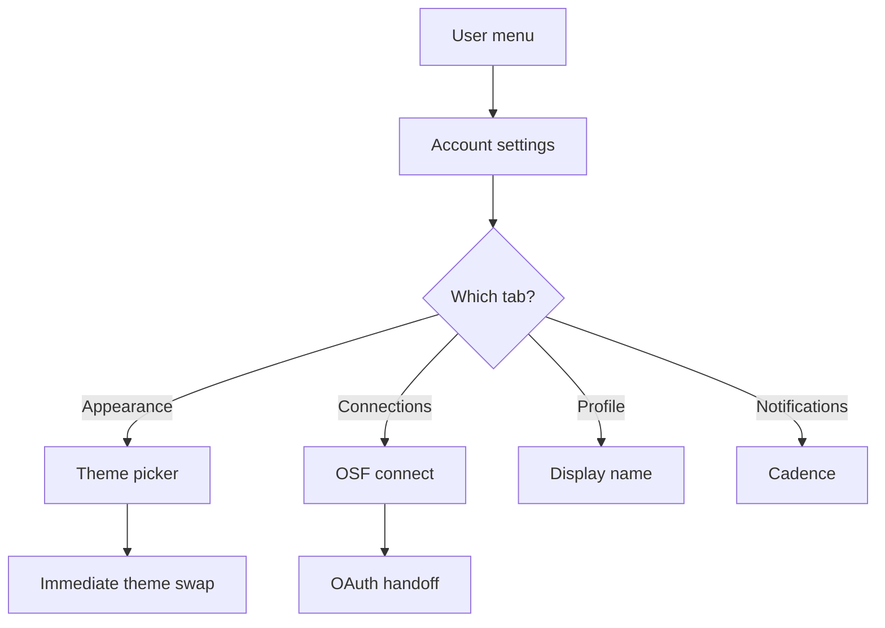

# User flow — Manage account settings

- **Job-to-be-done:** [Get set up](../jobs-to-be-done/get-set-up.md)
- **Primary persona:** [Hanna Kowalczyk — postdoc operator](../personas/postdoc-operator.md)
- **Secondary personas (if any):** …
- **Grounding insights:** …
- **Status:** draft

## Goal

The user updates identity (display name, avatar), visual preferences (theme), and optional connections (OSF, providers) without leaving the product.

## Preconditions

- Signed in.

## Postconditions

- Changes persisted; theme reflects immediately across the surface.
- OSF connection status accurate (connected | not connected | failed-last-time).

## Happy path

1. **Open user menu** (top-bar right slot). Dropdown shows Account settings, Workspace settings, Sign out.
2. **Click Account settings.** Routes to `/settings/account`. Center work surface shows tabbed sections: Profile · Appearance · Connections · Notifications.
3. **Switch theme on Appearance.** Three radio cards Light / Dark / System. Selecting one triggers immediate theme swap (no save button). Persists via Clerk user metadata + localStorage cache.
4. **Connect OSF on Connections.** Click `+ Connect OSF`. OAuth handoff. On return: row updates to "Connected as {ORCID name}". On failure: red badge "Last sync failed — retry."
5. **Update display name on Profile.** Inline edit; on blur, autosave.

## Branches and decision points

### Decision 1 (step 3) — theme preference

- **Decision:** Light / Dark / System (auto-follow OS via `prefers-color-scheme`).
- **Path A — Light or Dark:** explicit; product surface uses that theme everywhere; ignores OS.
- **Path B — System:** product surface follows OS preference; changes immediately if OS theme flips.

### Decision 2 (step 4) — OSF connect now or later

- **Decision:** the user can connect OSF on first visit or defer to first preregistration attempt.
- **Path A — Now:** OAuth handoff; row reflects status; preregistration pushes will work immediately.
- **Path B — Defer:** banner persists on study surface "Connect OSF before preregistering". No blocking.

## Failure modes

- **OSF OAuth fails** — row stays "Not connected"; retry inline + error reason.
- **Theme persistence fails** (Clerk down) — fallback to localStorage; banner notifies.
- **Concurrent edit (two tabs)** — last-write-wins; second tab notified.

## Out of scope

- Workspace-level settings (members, billing, AI policy) — separate flow.
- Per-target notification cadence picker — sub-flow.

## Open questions

- Notification cadence — per-target override vs global default. Lean global with overrides.
- Custom avatar upload — Clerk handles by default.

## Diagram

## Sources

- IA v0.3 — Account Settings location, Notifications open question.
- Brief v0.6 — Themeability section.
- ADR-0007 — Clerk for auth and user metadata.
- ADR-0005 — OSF per-user OAuth.
