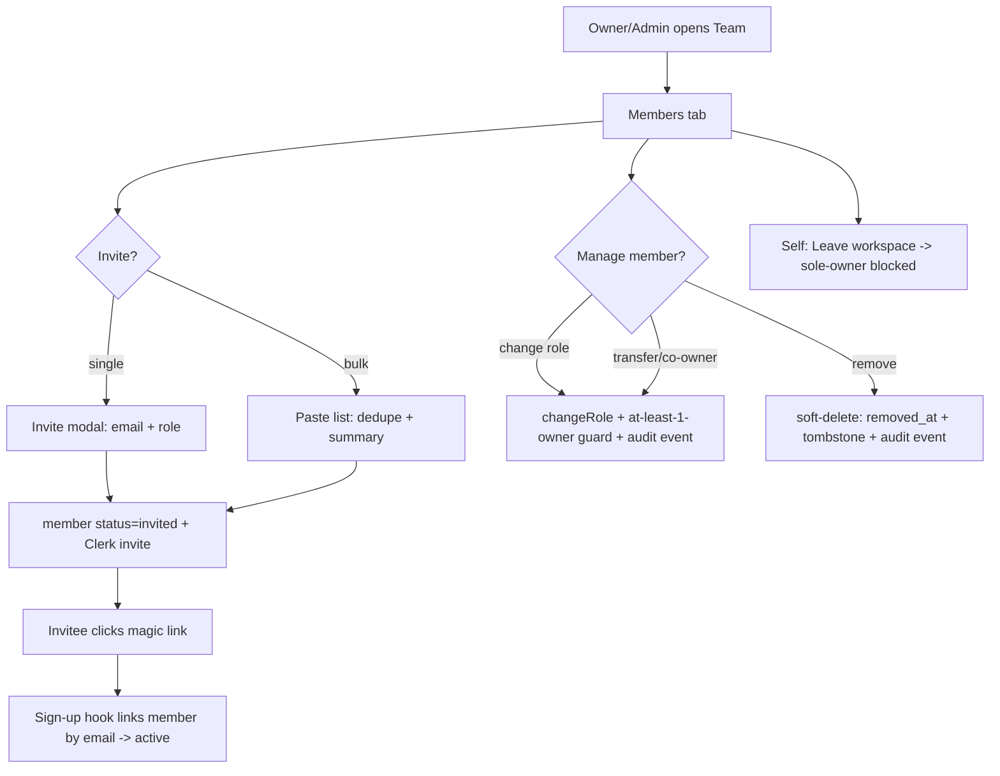

# User flow — Manage team members

- **Job-to-be-done:** [Get set up](../jobs-to-be-done/get-set-up.md)
- **Primary persona:** [Principal investigator](../personas/principal-investigator.md)
- **Secondary personas (if any):** [Postdoc operator](../personas/postdoc-operator.md)
- **Grounding insights:** [Persona segmentation & strategic risks](../../01_research/insights/persona-segmentation-and-strategic-risks.md), [Researcher tooling pain points](../../01_research/insights/researcher-tooling-pain-points.md)
- **Status:** draft

## Goal

A workspace owner/admin invites collaborators, assigns and adjusts their roles, and removes people who leave — so a lab's membership and access are explicit and self-served, without a DB insert.

## Preconditions

- The actor is signed in and is an **owner or admin** of the active workspace (viewers/editors can see the team but not manage it).
- The workspace exists (≥1 member — the owner).
- Clerk email delivery is configured (`clkmail.myresearchlab.app`, V1.7.0).

## Postconditions

- Invited people receive a magic-link invite; on sign-up their `user` row links to the pending `member` row and status flips to `active`.
- Role changes, removals, ownership transfers, and self-leaves are persisted, enforce the **always-≥1-owner** invariant, and emit audit events.
- Removed members are **soft-deleted** (tombstoned in historical attribution), not erased.

## Happy path

1. The PI opens **Team** in the LeftRail (now active) → lands on the **Members** tab (`/team`). (Trigger: navigation.)
2. They click **+ Invite member** → the invite modal opens.
3. They paste one or more emails, pick a role (default Editor), optionally add a personal message, and **Send invitations**. System creates `member(status:'invited')` rows + Clerk invitations; toast "Invited N members"; shifts to the **Invitations** tab.
4. The invitee clicks the emailed link → the existing magic-link sign-up flow → on first sign-in the post-sign-up hook links their new `user` row to the pending `member` row (by lowercased email) + flips status to `active`. They land in the workspace as the assigned role.
5. Back in **Members**, the new person now shows as Active. The PI can click a row to open the member detail, **change their role**, or **remove** them — each gated by the actor's role and confirmed.

## Branches and decision points

- **Decision: single vs bulk invite.** Path A (single) — one email. Path B (bulk) — paste a list/CSV; the system dedupes against existing members + pending invites and returns a summary ("5 sent / 1 already a member / 1 invalid").
- **Decision: change role to Owner.** Path A (transfer) — owner picks a successor; in one transaction the old owner becomes Admin and the successor becomes Owner. Path B (co-owner) — owner promotes an Admin to a *second* Owner; existing owners unchanged. Same endpoint; UI frames per intent.
- **Decision: who removes whom.** Owner removes anyone but self (transfer first if sole owner); Admin removes only Editor/Viewer. Removal is soft-delete.
- **Decision: leaving.** Any member can leave; the sole owner cannot (must transfer or delete the workspace).

## Failure modes

- **Last-owner guard:** demoting/removing/leaving the only owner → rejected with "A workspace needs at least one owner — transfer ownership first." (No raw error.)
- **Permission denied:** an admin tries to touch an owner, or an editor/viewer tries to manage → action not offered in UI; server rejects with FORBIDDEN as defence-in-depth.
- **Duplicate / already-member invite:** no-op; reported in the bulk summary ("already a member").
- **Invalid email:** skipped; reported in the summary.
- **Stale invitation (>14d):** flagged amber in the Invitations tab; the actor can Resend or Revoke.
- **Email didn't arrive:** the actor uses **Copy invite link** to share manually.

## Out of scope

- The cross-workspace "which workspaces am I in" view → that's the small `/me/memberships` Personal-mode surface (same build, separate route).
- Workspace-level invitation-email template editing (V1.14.1+), per-study role overrides (V1.16+), cross-workspace user search (V1.15+), workspace deletion.
- The participant-recruitment side of "people" → [Run a study](../jobs-to-be-done/run-a-study.md) / V1.15 Participants.

## Open questions

- None blocking — the five prior open questions were resolved by the owner 2026-06-15 (soft-delete, per-invite message, multiple owners, `/me/memberships`, filterable audit events); see ADR-0046.

## Diagram

