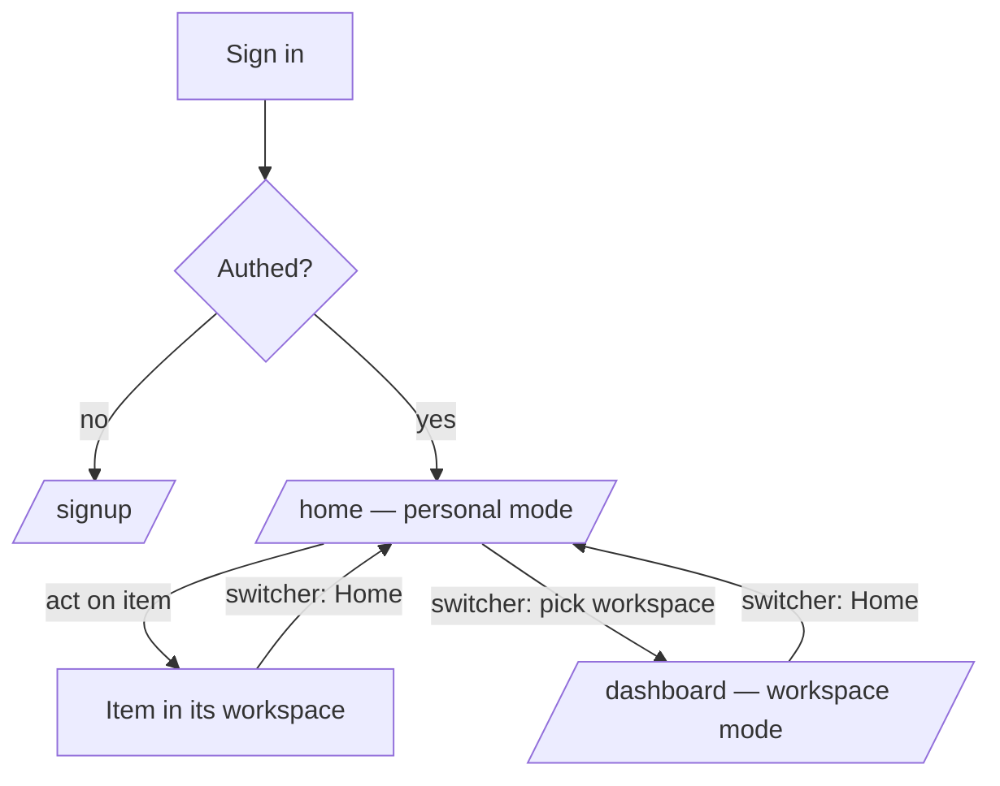

# User flow — Navigate Home and switch workspaces

- **Job-to-be-done:** [Get set up](../jobs-to-be-done/get-set-up.md)
- **Primary persona:** [Multi-site coordinator](../personas/multi-site-coordinator.md)
- **Secondary personas (if any):** [Postdoc operator](../personas/postdoc-operator.md), [Principal investigator](../personas/principal-investigator.md)
- **Grounding insights:** [Persona segmentation & strategic risks](../../01_research/insights/persona-segmentation-and-strategic-risks.md), [Researcher tooling pain points](../../01_research/insights/researcher-tooling-pain-points.md)
- **Status:** draft

## Goal

Let a researcher who belongs to more than one workspace see what needs their attention **across all of them** in one place, and move between workspaces deliberately — without losing track of which workspace they're in.

## Preconditions

Signed in; onboarding complete (≥1 workspace). The user may belong to one or many workspaces.

## Postconditions

The user has either (a) acted on a cross-workspace item from Home, or (b) switched into a specific workspace and landed on that workspace's dashboard, with the active workspace persisted for next session.

## Happy path

1. User signs in. (Trigger: authenticated request to `/`.) System routes them to **Home** (`/home`, personal mode) — the cross-workspace landing.
2. Home shows: a greeting + one-line context; a **Workspaces** card (every membership + role + last-activity + study count); review/mention items waiting on them; their cross-workspace recruiting studies + drafts; notifications; stats.
3. User reads what's pending. Decision point: act on a cross-workspace item, or enter a workspace.
4a. **Act in place:** click a review request / notification / study → navigate straight to that item *in its workspace* (the active workspace switches to that item's workspace as a side effect).
4b. **Enter a workspace:** open the workspace switcher (top bar) → pick a workspace → active workspace is set + the user lands on that workspace's **dashboard** (`/dashboard`, workspace mode).
5. To return to the cross-workspace view, open the switcher → **Home** (the entry above the workspace list) → back to `/home`.

## Branches and decision points

- **Decision — single-workspace user:** Home still works but is thin (one workspace). Path: the Workspaces card shows one row; the switcher still offers Home + that workspace. We do NOT special-case single-workspace users out of Home in v1 (revisit — see Open questions).
- **Decision — where "switch to a workspace" lands:** always `/dashboard` (the workspace dashboard), never `/studies`. Studies stays a sibling destination.

## Failure modes

- **A widget's data fails to load.** Response: that widget shows its own inline error + retry; the rest of Home renders (no full-page failure). Recovery: retry the widget.
- **Switch fails (stale/removed membership).** Response: the switcher marks that workspace unavailable; if the *active* workspace was removed, fall back to Home. Recovery: pick another workspace.
- **Zero workspaces** (shouldn't happen post-onboarding). Response: redirect to `/signup` (existing guard).

## Out of scope

- The contents of the *workspace* dashboard and the Studies·Running operational tab (separate wireframes).
- Per-user dashboard customization (drag/add/remove) — ADR-0036.
- Creating / leaving / renaming workspaces (account/workspace settings flows).

## Open questions

- Should a single-workspace user land on Home or skip to their workspace dashboard? Leaning: land on Home for consistency; cheap to special-case later. (Owner to confirm.)
- Does the root redirect flip to `/home` now, or stay `/studies` until Home is proven? Recommendation: ship `/home` reachable via the switcher first; flip the root redirect in a follow-up once it's solid.

## Diagram

