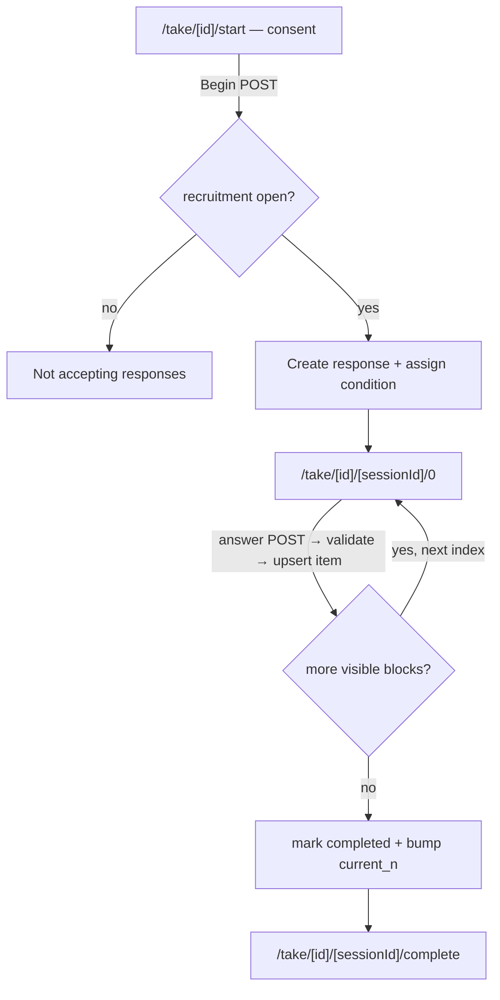

# User flow — Participant takes a study

- **Job-to-be-done:** [Run a study and collect responses](../jobs-to-be-done/run-a-study.md)
- **Primary persona:** [Hanna Kowalczyk — postdoc operator](../personas/postdoc-operator.md) — whose job this serves. **Acting user:** an anonymous study participant (not a platform persona; arrives via a recruitment link, never authenticated through Clerk).
- **Secondary personas (if any):** …
- **Grounding insights:** [researcher-tooling-pain-points](../../01_research/insights/researcher-tooling-pain-points.md)
- **Status:** draft

## Goal

An anonymous participant, arriving from a recruitment link Hanna shared, completes her preregistered study — assigned to one condition, every answer recorded durably — and reaches a clear completion screen. (Hanna previewing her own study walks the identical path with no data recorded.)

## Preconditions

- The study has a preregistered (immutable) ExperimentVersion (ADR-0002/0005) with at least one `condition` and at least one block in its `definition_snapshot`.
- Hanna has opened a `recruitment_session` (status `open`) for that version; its id is in the recruitment URL (ADR-0014).
- The participant is **not** signed in (no Clerk session); the `/take/*` routes are public.
- For Preview: Hanna is signed in and enters via `?preview=true`; the resulting `response.mode = 'preview'`.

## Postconditions

- A `response` row exists for the attempt: one `condition_id` (weighted-random, immutable), `mode` (`run`|`preview`), `status` (`started`→`completed`), a `current_question_index` pointer, `started_at`/`completed_at` (ADR-0014).
- A `response_item` row exists per answered block (`answer` JSON validated against the module's `responseSchema`), unique per `(response_id, block_instance_id)`.
- In `run` mode the `recruitment_session.current_n` reflects completes; in `preview` mode no counts move and Results excludes it by default.
- The participant sees the completion screen; closing/refreshing mid-study never loses prior answers (each answer is already persisted server-side).

## Happy path

1. **Open the recruitment link.** (Trigger: participant clicks the URL Hanna pasted into Prolific — `/take/[studyId]/start`, optionally `?PROLIFIC_PID=...`.) Server-rendered MPA (ADR-0013): no client router, no auth.
2. **Consent screen.** A minimal consent surface (ADR-0013) states what the study involves and — only if the researcher has configured third-party analytics (V1.6) — asks about tracking, defaulting to none. Participant clicks **Begin**. (Trigger: form POST.)
3. **Session created + condition assigned.** On first entry per recruitment_session the server creates a `response` (`status='started'`, `current_question_index=0`), assigns a `condition_id` by **weighted random** over the version's conditions, captures `external_pid` if present, then **redirects** to `/take/[studyId]/[response.id]/0`. The condition is recorded once and never changes on resume.
4. **Answer one question per page.** (Trigger: page load of `/take/[studyId]/[sessionId]/[questionIndex]`.) The RSC renders the block at that index for the assigned condition (blocks whose `visibility.showIfCondition` excludes this condition are skipped — server-side, never trusted from the client). The participant answers; **form POST → server action** validates the answer against the module `responseSchema`, upserts a `response_item`, advances `current_question_index`, and **redirects** to the next visible question's URL. Browser back/forward works (real page loads).
5. **Repeat** until the last visible block is answered.
6. **Completion.** The server marks `response.status='completed'`, sets `completed_at`, increments `recruitment_session.current_n` (run mode only), and redirects to `/take/[studyId]/[sessionId]/complete` — a terminal thank-you page (with the Prolific completion code/URL when configured, V1.6).

## Branches and decision points

- **Run vs Preview.** Decided once at session creation from `?preview=true` (and the caller being the signed-in researcher). Persisted on `response.mode`; **never re-read from the URL** on later requests (ADR-0013). Preview path is identical but writes `mode='preview'` and is excluded from Results/counts by default.
- **Resume.** Re-opening `/take/[studyId]/[sessionId]/[questionIndex]` for an existing `response` continues from its stored `current_question_index` with the same condition. A request for an index already passed simply re-renders that question (answers upsert, so re-answering overwrites that item only).
- **Condition-gated block.** At each index the server evaluates `visibility.showIfCondition` against the assigned condition; non-matching blocks are skipped in both directions so the index walk only stops on visible blocks.

## Failure modes

- **Closed/paused recruitment.** `recruitment_session.status != 'open'` → a polite "this study isn't accepting responses right now" page; no `response` created.
- **Unknown / malformed session or study id.** 404 take-page (not the researcher app's notFound chrome — participant runtime has its own minimal shell).
- **Invalid answer (fails `responseSchema`).** Server action re-renders the same question with an inline validation message; nothing advances, nothing is persisted for that item.
- **Duplicate external PID.** The partial unique index `(recruitment_session_id, external_pid)` rejects a second completed attempt from the same Prolific PID → "you've already taken this study" page.
- **Browser crash / network drop mid-study.** No special handling needed: prior `response_item`s are already persisted; reopening the link resumes at `current_question_index`.

## Out of scope

- Branching/skip logic beyond condition visibility, and per-block randomized question order — V1.6.
- Recruitment-provider integration (Prolific/CloudResearch as bookable services) — V1.6; V1.5 is copy-paste of the URL.
- The full GDPR data-rights flow (download/delete my data) — V1.6; V1.5 ships only the minimal consent surface.
- Results aggregation + CSV export — a separate surface (V1.5 step 6), not this flow.
- Researcher-side opening/pausing/closing recruitment — the Run stage flow, adjacent to this one.

## Open questions

- Consent copy: a single generic consent string for V1.5, or a researcher-editable field? Leaning generic for V1.5 (editable consent = V1.6 with the tracking-config UI).
- Completion screen for `preview` mode: show a "Preview complete — no data recorded" variant vs the participant thank-you. Leaning a distinct preview variant so Hanna is never confused about whether data was saved.

## Diagram

