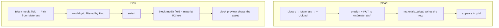

# User flow — Reuse workspace materials

- **Job-to-be-done:** [Build a study](../jobs-to-be-done/build-a-study.md)
- **Primary persona:** [Hanna Kowalczyk — postdoc operator](../personas/postdoc-operator.md)
- **Secondary personas (if any):** [Maya — multi-site coordinator](../personas/multi-site-coordinator.md)
- **Grounding insights:** [researcher-tooling-pain-points](../../01_research/insights/researcher-tooling-pain-points.md)
- **Status:** draft

## Goal

> One sentence: what the user is trying to accomplish.

A researcher keeps a reusable library of stimulus media (images, audio, video, documents) at the workspace level and drops the same asset into any study's media blocks without re-uploading it each time.

## Preconditions

> What must be true before the flow begins.

- Signed in, with an active workspace; write-capable for upload/edit.
- R2 storage is configured (the `ws/` namespace).
- **Pick path:** the researcher is editing a block that has a media field (image / audio / video / document stimulus).

## Postconditions

> What is true after the flow completes successfully.

- **Upload:** a `workspace_material` row exists with the asset stored under `ws/<workspace>/materials/<id>.<ext>`; it appears on Library → Materials.
- **Pick:** the edited block's media field references the material's R2 key (NOT the material id — orphan-safe; deleting the material later doesn't break the study), and the block renders that asset.

## Happy path

> Each step names the system response and the next decision point.

**Upload to the Materials tab (owner-pinned primary flow, 2026-06-22):**
1. Hanna opens **Library → Materials** and clicks **+ Upload**. (Trigger: she has a stimulus to reuse.) → File picker.
2. She picks a file. → Client validates kind/size, presigns + PUTs to R2 (`ws/<workspace>/materials/…`), then `materials.upload` writes the row. → The asset appears in the grid.

**Pick a material into the block you're editing (owner-pinned primary flow):**
1. While configuring a block's media field, Hanna clicks **Pick from Materials** (alongside "Upload from computer"). → A modal grid opens, filtered to the field's expected kind.
2. She selects a material. → The modal closes and the block's media field is set to that material's R2 key; the block preview shows it. (Decision point: keep, or pick a different one.)

## Branches and decision points

- **Decision (add media to a block):** upload-from-computer (study-scoped, existing) vs. **Pick from Materials** (reuse a library asset). Both set the same R2-key field; Pick avoids re-uploading.
- **Decision (where an asset comes from):** direct **+ Upload** in the Materials tab, or **Save to Materials** promotion from an existing study-block asset / a Playground card (secondary flows; the direct upload + pick is the owner-pinned core).
- **Kind filter:** the Pick modal defaults to the field's expected kind (image field → images), with an "all kinds" escape.

## Failure modes

- **Trigger:** upload too large / unsupported type. **System response:** inline error on the picker. **Recovery:** choose a different file.
- **Trigger:** R2 not configured. **System response:** "Media storage isn't configured." **Recovery:** workspace admin configures storage (Settings).
- **Trigger:** a picked material was deleted after selection. **System response:** the block still works (it stored the R2 key, not the id); the gateway serves the object or shows a labeled placeholder if the object is gone.
- **Trigger:** delete a material still referenced by studies. **System response:** a warning ("used in N studies") but the delete is allowed (soft); referring studies keep working (orphan-safe key).

## Out of scope

> What this flow deliberately does not cover, and which other flow does.

- Cross-workspace shared materials (workspace-scoped only; V2.x).
- Thumbnail generation / waveform previews (original asset or a type icon for v1).
- Templates / Themes reuse — separate Library flows (L1 / L4).

## Open questions

> Anything we are unsure about.

- Does "Save to Materials" from a study block COPY the R2 object into `ws/<workspace>/materials/` or reference the study-scoped key? (Assumed: copy, so the library asset is independent — owner-pinned acceptance covers the direct-upload + pick path; promotion is a secondary follow-up.)

## Diagram

> Embed or link the flow diagram.

