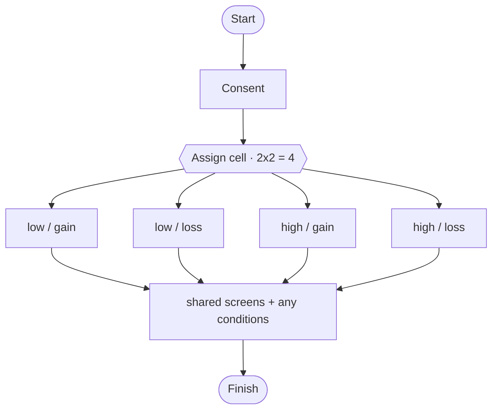

# User flow — Run a factorial (A/B) study

- **Job-to-be-done:** [Build a study](../jobs-to-be-done/build-a-study.md)
- **Primary persona:** [Postdoc operator](../personas/postdoc-operator.md)
- **Secondary personas (if any):** [Principal investigator](../personas/principal-investigator.md)
- **Grounding insights:** [Researcher tooling pain points](../../01_research/insights/researcher-tooling-pain-points.md)
- **Status:** draft

## Goal

> One sentence.

Run the *same* study in several **variants** that differ only in specific data (e.g. a post's like-count: low vs high = "social influence") — A/B, 2×2, 3×2, … — keeping them connected so shared content is edited once and each cell's differences are clear and trackable.

## Vocabulary (read first — these are different things)

- **Variant / cell** — the same study with some data changed. Defined by **factors** × **levels** (e.g. factor "Social influence" with levels *low* / *high*). A 2×2 = 2 factors × 2 levels = **4 cells**. Each participant sees exactly one cell (**between-subjects**).
- **Condition** — a *within-study* randomized arm (existing concept, ADR-0014). Conditions can still live **inside** a cell. Variants are a level above conditions, not a rename of them.
- **Shared content** — everything not bound to a factor; the single source of truth, identical across all cells.

## Preconditions

- Signed in, write-role member, a study's **draft tip** open in the Builder.

## Postconditions

- The study has ≥1 factor with ≥2 levels; the cells are generated; each varying field has a value per level; shared content is unchanged across cells.
- One recruitment randomly assigns each participant to a cell; results can be split by cell (and by condition within a cell).

## Happy path

1. In the Builder, the researcher opens **Variants** and adds a **factor** ("Social influence") with levels *low*, *high*. (System: shows a 1×2 matrix = 2 cells.)
2. They **bind a field to the factor**: on the social-post block, "this block's *likes* varies by *Social influence*". (System: that field becomes per-level; everything else stays shared.)
3. They fill the field's value per level (low = 12, high = 9,800). (System: each cell now resolves to a concrete config.)
4. They add a second factor ("Message frame": *gain* / *loss*) → the matrix becomes **2×2 = 4 cells**. (System: cross-product generated; only bound fields ask for values.)
5. They **edit shared content** once (reword a question). (System: the change applies to every cell automatically — shared is the source of truth.)
6. They open the **flow diagram / preview** and step through a chosen cell to sanity-check. (System: preview resolves that cell's overrides.)
7. They preregister / publish + open recruitment. (System: one link; each participant is randomly assigned a cell at start; the assignment is recorded immutably.)
8. In Results, they **split by cell** (and by condition within a cell). (System: per-cell aggregates; export carries cell + condition columns.)

## Branches and decision points

- **How many factors/levels** — 1 factor/2 levels (A/B) up to N factors; the cell count is the cross-product (guard rails on very large matrices — warn past ~12 cells).
- **Which fields vary** — any block-config field can be bound to a factor; unbound fields are shared.
- **Assignment** — between-subjects, randomized across cells at start (uniform by default; weights later).
- **Reversibility** — the whole feature is additive + flag-gated; removing all factors returns the study to a plain single-variant study with no residue.

## Failure modes

- **Combinatorial explosion** — too many cells. System: warn + require confirm past a threshold; never silently generate hundreds of cells.
- **Unfilled level value** — a bound field missing a value for some level. System: readiness check blocks preregister with a clear list.
- **Removing a factor with data collected** — System: confirm; on a frozen/registered study, factor structure is frozen (amendment, ADR-0004).
- **Bound field deleted** — the binding is dropped with a warning (like forward-condition cleanup).

## Out of scope

- Within-cell randomized arms — that's **conditions** (ADR-0014), unchanged here.
- Cross-study replication/forks (ADR-0018) — a different relationship.
- Adaptive / sequential designs (assignment that depends on earlier results).

## Open questions

- Per-cell allocation weights vs uniform (default uniform; weights a later add).
- Whether to allow a field to vary by a *combination* of factors (interaction-specific value) vs one factor at a time — default one-factor-per-binding for v1.

## Diagram

