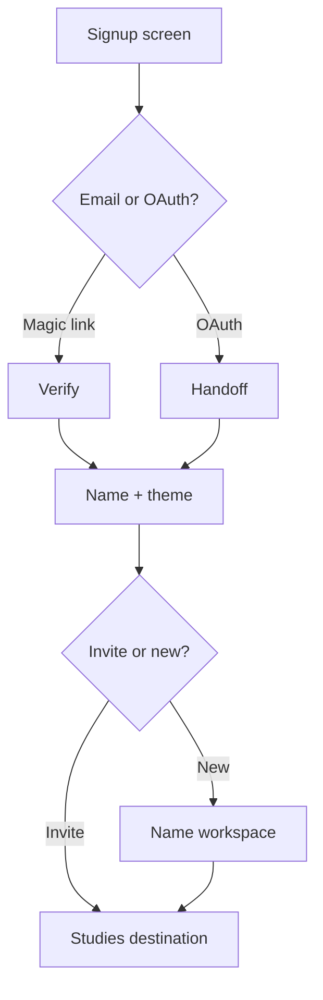

# User flow — Signup and onboard

- **Job-to-be-done:** [Get set up](../jobs-to-be-done/get-set-up.md)
- **Primary persona:** [Hanna Kowalczyk — postdoc operator](../personas/postdoc-operator.md)
- **Secondary personas (if any):** [Marek Stein — multi-site coordinator](../personas/multi-site-coordinator.md), [Sofia Marsh — burned replicator](../personas/burned-replicator.md)
- **Grounding insights:** …
- **Status:** draft

## Goal

A new user signs up (or accepts an invite), picks their theme preference and display name, and arrives on Studies destination with no further setup steps blocking real work.

## Preconditions

- The user has either an email address (signup path) or an invite link (join path).
- Clerk (auth provider per ADR-0007) is reachable.

## Postconditions

- A user record exists in the user table with display name + theme preference + (optional) OSF-account-not-yet-connected flag.
- The user is signed in.
- The user is either member of an existing workspace via invite, or sole member of a newly-created workspace.
- Default landing: Studies destination, Mine sub-nav, empty state if no studies exist.

## Happy path

1. **Land on signup screen.** Email + magic-link option + OAuth (Google). Plain Plex Serif headline "Build studies. Document everything."
2. **Verify identity** via magic link or OAuth. Clerk handles. On success, advance.
3. **Pick display name + theme.** Two-field form: display name (prefilled from OAuth where possible), theme picker (Light / Dark / System — radio cards with mini preview swatches).
4. **Branch: invite vs new workspace.** If signup came from invite, workspace is implicit. If standalone signup, ask: "Create a new workspace" with workspace name input.
5. **Land on Studies destination.** Empty state with `+ New study` CTA. Dismissible banner: "Connect OSF anytime in Settings — required for preregistration push."

## Branches and decision points

### Decision 1 (step 4) — invite vs new workspace

- **Decision:** does signup come with an implicit workspace, or does the user create one?
- **Path A — Invite link:** workspace inferred, step 4 skipped, user lands directly on Studies destination of the inviting workspace.
- **Path B — Standalone signup:** user names a new workspace, becomes sole member, lands on Studies destination of the new workspace.

## Failure modes

- **Magic link expired** — show "Link expired"; offer resend; preserve email.
- **OAuth denied** — return to signup; show "We couldn't connect with Google" with retry.
- **Invite link revoked** — show "This invite is no longer valid"; offer new-workspace path.

## Out of scope

- OSF connection flow (covered by [manage-account-settings](manage-account-settings.md)).
- Provider connection (deferred until first recruitment).
- Multi-user workspace member invitations (separate Team flow).

## Open questions

- ORCID as OAuth provider — researcher-coded but not in Clerk default. Defer to V1.5.
- Theme picker placement — onboarding (recommended) vs after first action.

## Diagram

## Sources

- ADR-0007 — Clerk as auth provider.
- IA v0.3 — Studies as default destination.
- [Get set up](../jobs-to-be-done/get-set-up.md) JTBD.
