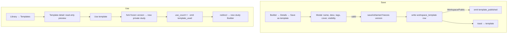

# User flow — Use and save templates

- **Job-to-be-done:** [Build a study](../jobs-to-be-done/build-a-study.md)
- **Primary persona:** [Hanna Kowalczyk — postdoc operator](../personas/postdoc-operator.md)
- **Secondary personas (if any):** [Maya — multi-site coordinator](../personas/multi-site-coordinator.md)
- **Grounding insights:** [researcher-tooling-pain-points](../../01_research/insights/researcher-tooling-pain-points.md)
- **Status:** draft

## Goal

> One sentence: what the user is trying to accomplish.

A researcher reuses a known-good study skeleton: either **saving** one of their studies as a named, curated **Template**, or **using** an existing Template (their own, a workspace colleague's, an app-shipped starter, or a public one) as the starting point for a new study.

## Preconditions

> What must be true before the flow begins.

- Signed in, with an active workspace and at least one membership.
- **Save path:** the researcher has a study open in the Builder.
- **Use path:** at least one Template is visible to the researcher (their workspace's, a starter, or a public one). The empty Templates tab still renders with guidance.

## Postconditions

> What is true after the flow completes successfully.

- **Save:** a `workspace_template` row exists, frozen against a named version of the source study; it appears on the Library → Templates tab at its chosen visibility (private / workspace / public). The source study is unchanged and keeps evolving independently.
- **Use:** a new private study exists in the caller's active workspace, containing a copy of the template's blocks / conditions / theme / overview (instanceIds preserved); the template's `use_count` is incremented; the researcher lands in the new study's Builder.

## Happy path

> Each step names the system response and the next decision point.

**Save as template (from the Builder):**
1. Hanna opens her study's Builder → Details panel and clicks **Save as template**. (Trigger: she wants to reuse this design.) → System opens the Save-as-template modal, pre-filled with the study title as the default name.
2. She sets name (required), description, tags, an optional cover image, and a **visibility** (Private / Workspace / Public). → System validates (non-empty name).
3. She clicks **Save template**. → System freezes the current working tip as a named version (`studies.saveAsNamed`), writes the `workspace_template` row referencing that version, closes the modal, and confirms with a toast linking to the new template. If visibility is Workspace/Public, it emits `template_published`.

**Use a template (from the Library):**
1. Maya opens **Library → Templates**. → System lists templates visible to her (workspace + starters + public), filterable and searchable.
2. She opens a template's detail page to preview its blocks. (Decision point: use it or keep browsing.) → System renders a read-only block preview + metadata.
3. She clicks **Use template**. → System calls `templates.useTemplate`, which forks the template's frozen version into a new private study in her active workspace, increments `use_count`, emits `template_used`, and redirects her to the new study's Builder.

## Branches and decision points

- **Decision (save):** visibility. **Private** → only the author's workspace sees it; no event. **Workspace** → all workspace members see it in their Templates tab; emits `template_published` to members. **Public** → any workspace can use it (surfaced via Browse, not a Library marketplace in this scope); emits `template_published` to the author's followers.
- **Decision (use):** start from a template vs. start blank. Start-blank is the existing "new study" flow; this flow covers only the template path.
- **Decision (use, missing modules):** if the template references a module/version not installed in the caller's catalogue, the system still forks (core modules are universal in V1); a substitution affordance is an Imports-stream concern (L5), not Templates.

## Failure modes

- **Trigger:** name collides with an existing template in the workspace. **System response:** inline "A template with this name already exists." **Recovery:** edit the name; the modal stays open.
- **Trigger:** `saveAsNamed` fails (e.g. the study has unsaved/invalid state). **System response:** error toast; modal stays open, nothing written. **Recovery:** retry, or fix the study first.
- **Trigger:** cover-image upload fails. **System response:** non-blocking warning; the template can still be saved without a cover. **Recovery:** retry the upload or save without one.
- **Trigger:** `useTemplate` fails mid-fork. **System response:** error toast; no partial study is left visible. **Recovery:** retry from the template detail page.
- **Trigger:** the template was deleted between list and use (soft-deleted). **System response:** "This template is no longer available." **Recovery:** return to the Templates list.

## Out of scope

> What this flow deliberately does not cover, and which other flow does.

- Discovering *public* templates across all workspaces — that lives in the existing [Browse public studies](discover-and-replicate-public-studies.md) flow (filtered to templates), not a dedicated marketplace.
- Editing the template's *content* — a template is frozen; "v2" is a new template from a newer source version (no template-internal versioning).
- Materials / Themes / Imports reuse — separate flows in the Library-completion handoff (L3 / L4 / L5–L7).
- The starter-template migration of the Misinformation framework — covered by the Frameworks-removal stream (L2).

## Open questions

> Anything we are unsure about.

- Should "Use template" land on the new study's Builder, or a confirmation interstitial first? (Assumed: straight to Builder, matching fork.) — owner to confirm at high-fi.
- Public templates: do we reuse the existing follow/Browse affordances verbatim, or add a "Templates" facet to Browse? (Assumed: a facet on existing Browse; no new surface.) — defer to L1.2.

## Diagram

> Embed or link the flow diagram.

