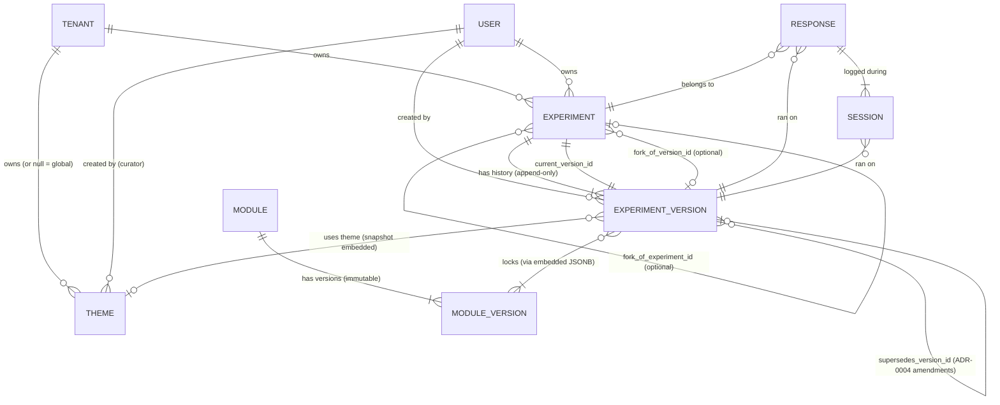
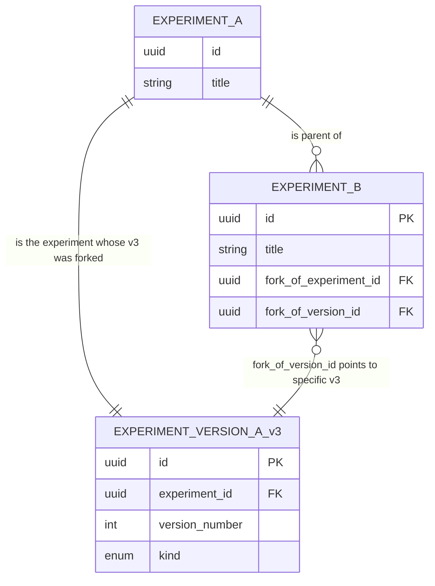

# Core data-model entities

> **Status:** sketch — grounds ADR-0001 and ADR-0002. Not yet a migration; deliberately not a schema-managed manifest artifact (data-model files are tightly coupled to ADRs and benefit from being read together). Promote to per-entity files when individual entities accumulate enough complexity to warrant it.
>
> **Date:** 2026-05-28
> **Related:** [ADR-0001 — modular composition + theme overlays](../adrs/0001-modular-composition-theme-overlays.md), [ADR-0002 — forking model](../adrs/0002-forking-model.md), [STACK.md](../../STACK.md) (Drizzle + Postgres), [01_research/insights/researcher-tooling-pain-points.md](../../01_research/insights/researcher-tooling-pain-points.md)

## Purpose

Make ADR-0001 and ADR-0002 concrete by sketching the entities they imply: identifiers, fields, invariants, relationships. The sketch surfaces decisions that the ADRs left implicit and contradictions between them, so we can resolve them now rather than at build time.

This is not yet a Drizzle schema or a migration. It's the conceptual model the schema will derive from. Field types are at the level of "uuid / string / json / enum / int / nullable timestamp" — Postgres-specific column types come later.

## Overview ER diagram

**Reading the diagram:**

- Solid double pipe (`||`) = one and only one. Crow's foot (`o{` or `|{`) = many.
- `||--|{` reads as "1-to-many, at least one." `||--o{` reads as "1-to-many, possibly zero."
- `}o--o|` reads as "many to optional one" (the fork relationships).
- Participant data tables (RESPONSE, SESSION) are shown but **never** referenced by forks — see Cross-cutting concerns §3.

### Fork lineage sub-diagram

A separate view of just the fork edges, because they're the most subtle:

The lock is on the version, not the parent. Bob's experiment can advance to v5 without affecting Alice's fork, which still references his v3.

---

## Entities

### Module

The atomic unit — a question type or artifact (per ADR-0001's granularity decision). `Module` is the **conceptual identity**; `ModuleVersion` is the specific snapshot with schema and behavior.

**Fields:**

| Field | Type | Description |
| --- | --- | --- |
| `id` | uuid | Internal primary key |
| `source` | string | Per ADR-0001: identity namespace. V1: always `"core"`. Future: `"plugin:foo"`, etc. |
| `key` | string | Kebab-case identifier within source (e.g., `social-post`, `likert-scale`, `video-clip`) |
| `name` | string | Display name |
| `description` | string | Short purpose |
| `category_tags` | string[] | For theme filtering and discovery (e.g., `["misinformation", "social"]`) |
| `created_at` | timestamp | |

**Invariants:**

- `(source, key)` is globally unique. There is exactly one `core/social-post` Module.
- `key` matches `/^[a-z][a-z0-9-]*$/` (kebab-case, lowercase).
- `source` matches `/^[a-z][a-z0-9-]*(\:[a-z][a-z0-9-]*)?$/` (e.g., `core` or `plugin:misinfo-pack`).

**Relationships:**

- 1 Module → many ModuleVersions.
- No direct relationship to Experiment — ExperimentVersions reference ModuleVersions, not Modules.

**Notes:**

- The full module identity used in ADR-0001 (`source/key@version`) is a *display* convention; in the schema it's resolved by joining Module to ModuleVersion.
- No `tenant_id` in V1 — modules are platform-level. When plugins arrive (ADR-0007 deferred), `source` distinguishes per-plugin module sets and a separate `Plugin` table would own them.

---

### ModuleVersion

A specific version of a Module. Immutable. Carries the schema and (by reference, via the runtime) the behavior code.

**Fields:**

| Field | Type | Description |
| --- | --- | --- |
| `id` | uuid | Internal primary key |
| `module_id` | uuid FK → Module | Which module this is a version of |
| `version` | string | Semver string, e.g., `1.0.0` |
| `schema` | json | Zod schema (serialized) or JSON Schema for instance data |
| `changelog` | string | What changed from the previous version |
| `is_breaking` | boolean | True for major bumps; derivable from semver but stored for query convenience |
| `supersedes_version_id` | uuid FK → ModuleVersion (nullable) | Optional chain pointer for migrations |
| `migration_to_next` | json (nullable) | Optional migration function reference for upgrading instance data |
| `created_at` | timestamp | |
| `deprecated_at` | timestamp (nullable) | When marked deprecated. Resolvable but discouraged for new use. |

**Invariants:**

- `(module_id, version)` is unique.
- Once created, `schema` is **immutable** (per ADR-0001's schemas-first principle). To change the schema, you create a new ModuleVersion.
- `version` follows semver.
- Deprecated versions remain resolvable for existing forks per ADR-0001's fork-safety principle.

**Relationships:**

- many ModuleVersions → 1 Module.
- Referenced by ExperimentVersion via the embedded `module_version_locks` JSON (see ExperimentVersion).

**Open question:** Where does the *runtime code* for a module live? Two options:
1. In-repo code keyed by `source/key/version`. Deprecated versions stay in the codebase.
2. WASM modules or dynamically-loaded JS keyed similarly.

V1: option 1 (in-repo). The repo grows as versions accumulate; pruning is a future operational concern, not a schema concern.

---

### Theme

A pure-functional overlay per ADR-0001. Declares visible modules, defaults, layout hints, curated frameworks, helper widgets. Never mutates a module; only filters and configures.

**Fields:**

| Field | Type | Description |
| --- | --- | --- |
| `id` | uuid | Primary key |
| `tenant_id` | uuid FK → Tenant (nullable) | `null` = global built-in theme (e.g., `default`, `misinformation`). Non-null = tenant-owned custom theme. |
| `key` | string | Kebab-case identifier (e.g., `default`, `misinformation`, `acme-custom-theme`) |
| `name` | string | Display |
| `description` | string | |
| `created_by` | uuid FK → User (nullable for built-in) | |
| `visible_modules` | json | Array of `{source, key, version_constraint}` declaring which modules are surfaced |
| `module_defaults` | json | Map of `source/key` → default instance config |
| `curated_framework_ids` | uuid[] FK → Framework | Pre-built protocols this theme ships with |
| `helper_widgets` | json | Array of widget configs (e.g., sample-size calculator for misinformation theme) |
| `layout_hints` | json | Editor IA hints (grouping, ordering) |
| `created_at` | timestamp | |
| `updated_at` | timestamp | |

**Invariants:**

- `(tenant_id, key)` unique. Two tenants can both have a `custom-pilot` theme.
- Themes never reference experiment data — only Modules (by source/key, not by ModuleVersion) and Frameworks.
- Themes are **mutable** in V1 (no ThemeVersion entity). When an ExperimentVersion is created, the relevant theme state is snapshotted into the version — see Cross-cutting concerns §2.

**Relationships:**

- many Themes → 1 Tenant (or 0 if global).
- 0 Themes ← many ExperimentVersions (loosely; the snapshot is what's authoritative).

---

### Experiment

A research study/project. The mutable working container; its *actual content at any moment* is in ExperimentVersion (specifically, `current_version_id` points to the working tip).

**Fields:**

| Field | Type | Description |
| --- | --- | --- |
| `id` | uuid | Primary key |
| `tenant_id` | uuid FK → Tenant | Always non-null. Forks live in the *forker's* tenant, not the parent's. |
| `owner_id` | uuid FK → User | |
| `title` | string | |
| `description` | string | |
| `current_version_id` | uuid FK → ExperimentVersion | Points to the latest version — the "working tip." Updated on every save. |
| `forkable_by` | enum | `public` / `link-only` / `private`. Default: `public` if `tenant` is public-org, else `private`. |
| `fork_of_experiment_id` | uuid FK → Experiment (nullable) | Parent. Null for original experiments. |
| `fork_of_version_id` | uuid FK → ExperimentVersion (nullable) | Specific version of parent that was forked. Required iff `fork_of_experiment_id` is set. |
| `created_at` | timestamp | |
| `updated_at` | timestamp | |
| `archived_at` | timestamp (nullable) | Soft-archive without delete |

**Invariants:**

- `tenant_id` is never null.
- If `fork_of_experiment_id IS NOT NULL` then `fork_of_version_id IS NOT NULL` (and vice versa). DB-level CHECK constraint.
- `current_version_id` always points to an ExperimentVersion whose `experiment_id` equals this experiment's `id` (self-consistency).
- `fork_of_version_id` references a version of `fork_of_experiment_id` (cross-table consistency — enforced at app level or via trigger).
- An Experiment may belong to one tenant and have a parent in a different tenant. This is the cross-tenant fork case and is fine: the fork operation copies the snapshot, not the parent's tenant data.

**Relationships:**

- many Experiments → 1 Tenant.
- many Experiments → 1 User (owner).
- 1 Experiment → many ExperimentVersions.
- 1 Experiment → 1 ExperimentVersion (current_version_id, also a member of the many-side history).
- 0 or 1 Experiment → 0 or 1 Experiment (fork_of, self-referential).
- 0 or 1 Experiment → 0 or 1 ExperimentVersion (fork_of_version_id; references a version of the parent).

---

### ExperimentVersion

An immutable snapshot of an Experiment at a moment in time. Append-only. The unit of replication and the unit of preregistration.

**Fields:**

| Field | Type | Description |
| --- | --- | --- |
| `id` | uuid | Primary key |
| `experiment_id` | uuid FK → Experiment | Which experiment this version belongs to |
| `version_number` | int | Monotonic per experiment, starting at 1 |
| `kind` | enum | `autosave` / `named` / `preregistered` / `published` |
| `name` | string (nullable) | Required for `named`, `preregistered`, `published`. Null for `autosave`. |
| `description` | string (nullable) | |
| `definition_snapshot` | json | Full experiment definition — blocks, module instances, configs, randomization rules, etc. |
| `module_version_locks` | json | Array of `{source, key, version}` triples. Every module instance in `definition_snapshot` resolves to one of these. |
| `theme_id` | uuid FK → Theme (nullable) | The theme in use at version creation time |
| `theme_snapshot` | json | Frozen copy of the theme's state at version creation. Used at runtime; `theme_id` is for attribution/lineage. |
| `created_by` | uuid FK → User | |
| `created_at` | timestamp | |
| `external_registration_url` | string (nullable) | OSF preregistration URL, etc. Set when kind=preregistered. |
| `external_publication_url` | string (nullable) | DOI / paper URL. Set when kind=published. |
| `supersedes_version_id` | uuid FK → ExperimentVersion (nullable) | Per ADR-0004: when this version amends a prior preregistered version, points to that prior version. |
| `change_summary` | string (nullable) | Per ADR-0004: required (non-empty) when `supersedes_version_id` is set; null otherwise. Free-form explanation of what changed and why. |
| `amendment_classification` | enum (nullable) | Per ADR-0004: optional self-classification — `typo` / `methodological-correction` / `clarification` / `scope-change` / `other`. For filtering, never enforced. |

**Invariants:**

- `(experiment_id, version_number)` unique.
- **Immutable after creation.** Only INSERT, never UPDATE or DELETE. (Soft-delete via Experiment.archived_at, but the version rows themselves never change.)
- `kind = preregistered` and `kind = published` rows **cannot be deleted** under any circumstance (not even when the parent Experiment is archived — they must remain resolvable for citations).
- `name` is required (non-null) when `kind != 'autosave'`.
- Every module instance in `definition_snapshot` references a `(source, key, version)` triple that appears in `module_version_locks`.
- Every entry in `module_version_locks` resolves to an existing ModuleVersion row at creation time (enforced at app level — once the version exists, the lock entry is preserved even if the ModuleVersion is later marked deprecated).
- `theme_snapshot` is the authoritative source at runtime; `theme_id` is for lineage display.
- **DB CHECK (from ADR-0004):** `(supersedes_version_id IS NULL AND change_summary IS NULL) OR (supersedes_version_id IS NOT NULL AND change_summary IS NOT NULL AND length(trim(change_summary)) > 0)`. Either both are set (this is an amendment) or both are null (this is an original version).
- **App-level (from ADR-0004):** when `supersedes_version_id` is set, the referenced version must itself be `kind = preregistered`. Amendments only apply to preregistrations; other versions just progress normally.

**Relationships:**

- many ExperimentVersions → 1 Experiment.
- many ExperimentVersions → 1 User (created_by).
- many ExperimentVersions → 0 or 1 Theme.
- many ExperimentVersions →→ many ModuleVersions (logically, via the JSON `module_version_locks` array — not a relational join table in V1).

**Design choice — module locks as JSON vs. join table:**

- **JSON (chosen for V1):** `module_version_locks` is a JSONB array. Pros: snapshot atomicity — the lock set is part of the immutable version row. Cons: harder to query ("which experiments use `core/social-post@1.0.0`?" requires JSON ops, not a simple JOIN).
- **Join table (deferred):** A separate `experiment_version_module_lock` table. Pros: queryable. Cons: another append-only table to keep consistent with the version snapshot.

For V1, JSON is acceptable. Add the join table when "which experiments use module X?" becomes a frequent query (likely V2 for module deprecation reports).

---

### Fork — *not a separate entity*

ADR-0002 talks about forks as an operation and as a concept, but in the data model **a fork is just an Experiment with non-null `fork_of_experiment_id` + `fork_of_version_id`**. No separate `Fork` table.

**Reasoning:**

- Every fork is itself an Experiment with the same lifecycle (versions, edits, further forks).
- The lineage information (parent + parent version) fits naturally on the Experiment row.
- "Show me all forks of X" is `SELECT * FROM experiment WHERE fork_of_experiment_id = X`.
- Multi-step lineage ("trace this fork back to its root") walks `fork_of_experiment_id` transitively.

**What a separate `ForkEvent` table might add later:**

- Richer attribution metadata (who initiated, what message they wrote, timestamps for fork moments separate from Experiment.created_at).
- A `merge_back_request` workflow when ADR-0002's pull-from-upstream gets unlocked.
- Per-fork analytics (citation count, derivative count).

Deferred until we need any of these. The data model leaves room — `ForkEvent.fork_experiment_id` would just be an FK.

---

### Framework + FrameworkVersion — *parallel to Experiment, briefly*

ADR-0001 distinguishes Framework (curated reusable protocol) from Module (atomic question type). ADR-0002 says frameworks share the forking model. Briefly:

**Framework** mirrors Experiment structurally:

- `id`, `tenant_id` (nullable — null = curator-owned global), `owner_id`, `title`, `description`, `current_version_id`, `forkable_by`, `fork_of_framework_id`, `fork_of_version_id`, `verified_badge` (boolean, curator-applied per the human-curation decision), timestamps.

**FrameworkVersion** mirrors ExperimentVersion:

- Same immutable-snapshot model. `definition_snapshot` is a framework definition (composition of blocks/modules); `module_version_locks` exists for the same reason.

Frameworks deserve their own entry file (`01-framework-entities.md`) when they get fleshed out — likely when ADR-0008-or-so addresses "how does a curator publish a framework?"

---

## Cross-cutting concerns

These are the places where ADR-0001 and ADR-0002 interact, and where the data model has to make a call.

### 1. Module-version lock storage

**Decision:** Embed as JSONB inside `ExperimentVersion.module_version_locks`. Snapshot atomicity wins over queryability in V1. Promote to a join table when query patterns demand it.

### 2. Theme snapshot vs. versioning

**Tension:** ADR-0001 says themes are mutable overlays. ADR-0002 says versions are immutable snapshots. If a theme changes between ExperimentVersion A (created Monday) and ExperimentVersion B (created Wednesday), what theme does A run on?

**Decision:** Embed `theme_snapshot` as JSONB inside `ExperimentVersion`. The `theme_id` FK is kept for attribution and lineage, but the *authoritative theme state* at version time is the embedded snapshot. Themes can evolve freely without breaking past versions.

**Alternative we rejected:** Make Theme itself versioned (`ThemeVersion`). This is cleaner long-term but adds a whole entity for V1. Snapshot-embed is the cheap version-safe move; we can introduce ThemeVersion later if theme evolution becomes a first-class concern.

### 3. Participant data isolation across forks

**Hard rule from ADR-0002:** Participant data never crosses fork boundaries. The data model enforces this structurally:

- `Response` and `Session` tables (not fully sketched here) reference `experiment_id` and `experiment_version_id`. They do **not** participate in the fork-copy operation.
- The fork operation:
  1. Creates a new Experiment row with `fork_of_*` FKs set.
  2. Copies the parent's `ExperimentVersion` rows? **No** — references them via `fork_of_version_id` instead. The fork's own version history starts fresh at v1.
  3. Wait — actually, the fork starts with v1 being a *copy of the parent's snapshot*. Let me reconcile this.

**Clarification:** The fork creates a new Experiment with one initial ExperimentVersion (v1, kind=`autosave` or `named` depending on UX). That v1's `definition_snapshot` is *copied from* the parent's referenced version's `definition_snapshot`. The `module_version_locks` are likewise copied. After that, the fork accumulates its own version history independently. The `fork_of_version_id` is the historical reference to where it came from; the fork's own v1 is the working start.

This also means: Response/Session tables are filtered out trivially because the fork operation only touches Experiment and ExperimentVersion tables.

### 4. Deprecated module handling

**Rule from ADR-0001:** Old experiments still run on their locked module versions. The data model:

- `ModuleVersion.deprecated_at` is informational. Resolvers don't refuse to load deprecated versions.
- When a researcher edits a fork that uses a deprecated module version, the UI surfaces an "upgrade available" prompt with the migration path (if `migration_to_next` is set).
- Upgrading is an explicit action that creates a new ExperimentVersion with the new module version in `module_version_locks` and migrated instance data in `definition_snapshot`.

### 5. Cross-tenant forks

When Alice (Tenant Beta) forks Bob's experiment (Tenant Alpha):

- New `Experiment.tenant_id` = Beta.
- `fork_of_experiment_id` points across the tenant boundary to Bob's experiment in Alpha.
- This is allowed because the FK is just a reference — no Alpha tenant data is exposed to Beta via this relationship beyond the snapshotted definition (which Alice already had read access to in order to fork).
- The `forkable_by` permission on Bob's experiment is what gates whether Alice could have read it in the first place.

**Implication for queries:** "Show me all forks of my experiments" requires Bob to query `Experiment WHERE fork_of_experiment_id IN (SELECT id FROM experiment WHERE tenant_id = alpha)`. This works fine; just note that Bob's view will surface forks owned by other tenants.

### 6. Preregistration amendments (per ADR-0004)

A `kind: preregistered` version is immutable forever (ADR-0002). But researchers sometimes need to correct legitimate errors — typos, broken URLs, omitted exclusion criteria. The amendment mechanism preserves immutability while allowing corrections:

- Researcher files an **amendment**: a new `kind: preregistered` ExperimentVersion with `supersedes_version_id` pointing to the prior preregistered version and a required `change_summary`.
- Both versions remain public, immutable, and queryable. Each has its own permanent URL.
- The UI shows lineage in both directions: viewing the prior version surfaces "Superseded by amendment on YYYY-MM-DD"; viewing the amendment surfaces "Amends version N: [change_summary]".
- The freeze pass (ADR-0003) runs on amendments the same as on original preregistrations.
- OSF push (ADR-0005, forthcoming) treats each amendment as a new OSF registration referencing the prior DOI.
- The DB CHECK constraint above enforces that the supersedes/change_summary pair is consistent. App-level validation ensures the superseded version is itself preregistered.

### 7. Module schema validation timing

**ADR-0001 says:** "The platform validates module data against the declared schema on read and write."

**At write time:** When a module instance is added or edited in the working ExperimentVersion's `definition_snapshot`, the platform looks up the relevant ModuleVersion's schema and validates. Failed validation rejects the edit.

**At read time:** When loading an old ExperimentVersion (e.g., to replay a registered experiment), the platform looks up the same ModuleVersion (which still exists per immutability) and validates. This is mainly defensive — if validation fails on an old snapshot, something corrupted the snapshot, because it was valid when written.

**Schema evolution:** New ModuleVersions are new schemas. Old snapshots validate against old schemas via the version pin. Migration scripts (`ModuleVersion.migration_to_next`) transform instance data when a fork upgrades.

---

## Contradictions surfaced (now resolved)

- **Mutable themes + immutable versions.** Resolved via embedded theme_snapshot. Theme evolution is non-destructive.
- **Module version locks as snapshot vs. queryable.** Resolved as JSONB embed for V1; promote to join table when needed.
- **Fork = copy or reference?** Both, at different layers. Lineage = reference (FKs). Working content of the fork's first version = copy (from parent's snapshot). Subsequent versions = independent.
- **Cross-tenant forks.** Allowed; permission gate is `forkable_by`, not tenant boundary.
- **Deprecated modules.** Stored but not refused. Old experiments continue to run.

## What this sketch deliberately does NOT cover

- **Response, Session, Participant** — participant data tables. Need a separate entry once ADR-0003 (asset storage) and ADR-0004 (OSF integration) clarify what data flows where.
- **Tenant, User, Membership, Role** — auth/tenancy entities. Deferred to ADR-0006 (Path A vs Path B); Clerk Organizations and Auth.js + RLS imply different table shapes.
- **Asset, AssetReference** — uploaded materials, stimuli, media. Deferred to ADR-0003.
- **FrameworkVersion fully fleshed out** — sketched here briefly; deserves its own entry when curator workflows are designed.
- **Plugin, ModuleSource** — deferred entities for the plugin path (ADR-0007).
- **AnalyticsEvent, AuditLog** — observability. Their own concerns.
- **PreregistrationLink, PublicationLink** — currently URLs on ExperimentVersion. Could become entities later for richer OSF/DOI integration.

## Open questions

1. **Should ExperimentVersion store the full definition or a delta from the previous version?** Full snapshot is simpler and more robust (any version is self-contained). Deltas save storage but make replay more fragile. V1 recommendation: full snapshot, accept the storage cost, revisit when storage cost becomes operationally painful.
2. **How long do `autosave` versions live?** Forever in V1 (cheap, simple). A pruning policy ("keep last 50 autosaves per experiment, never prune named/preregistered/published") is a likely V2 ADR.
3. **What does a module "instance" look like inside `definition_snapshot`?** Out of scope for this sketch — the snapshot is opaque JSON to the schema layer. The shape will be defined by the experiment-definition format ADR, which is implicit in ADR-0001 but not formally written yet.
4. **Cross-version migration during fork upgrade:** when Alice's fork is on `social-post@1.0.0` and she upgrades to `2.0.0` (a breaking change with `migration_to_next` provided), is the migration applied automatically, or does she review the migrated state first? V1 UX call, not a schema concern.
5. **Soft-delete vs. hard delete of Experiment:** sketched as `archived_at`. Need to confirm that `kind=preregistered` and `kind=published` versions remain resolvable even when their parent Experiment is archived. The cleanest answer: archiving the Experiment hides it from default views but its versions remain queryable by ID for citation purposes.
