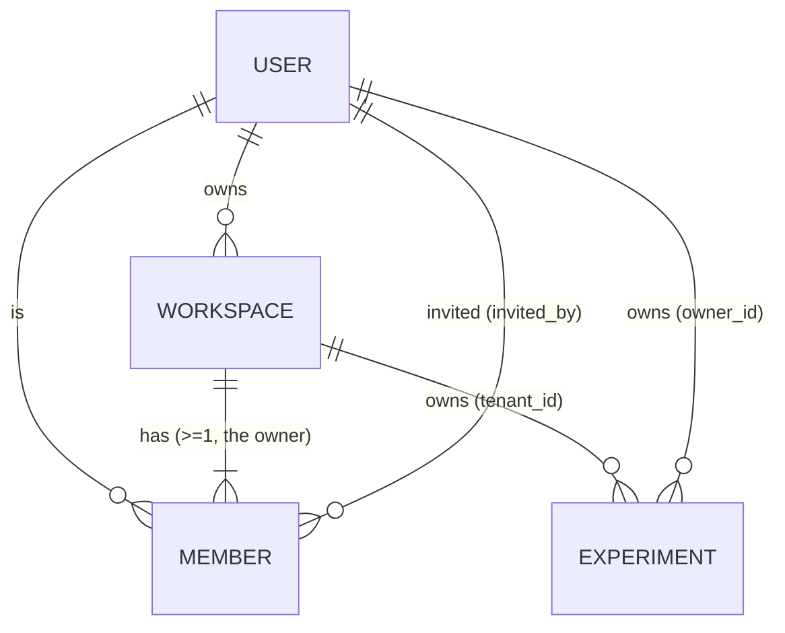

# Auth + tenancy entities

> **Status:** sketch — grounds [ADR-0007](../adrs/0007-path-a-vs-b.md) (Clerk identity, membership in our DB) and [ADR-0011](../adrs/0011-scaffold-strategy.md) step 2/3 (the first Drizzle migration). Companion to [00-core-entities.md](00-core-entities.md), which deliberately deferred these entities ("Tenant, User, Membership, Role — auth/tenancy entities. Deferred"). This file resolves that deferral.
>
> **Date:** 2026-06-01
> **Related:** [ADR-0007](../adrs/0007-path-a-vs-b.md), [ADR-0011](../adrs/0011-scaffold-strategy.md), [00-core-entities.md](00-core-entities.md), [lock-in-inventory.md](../lock-in-inventory.md), [05_app/server/adapters/auth.ts](../../05_app/server/adapters/auth.ts)

## Purpose

Make the auth + tenancy boundary concrete before the first migration. `00-core-entities.md` modelled Experiment / ExperimentVersion with a `tenant_id` it never defined an owning entity for. This file defines that entity (Workspace) plus User and Member, and locks the one decision that touches every later table: **where identity ends and our data begins.**

This is not yet a Drizzle schema — it's the conceptual model the schema in [05_app/server/db/schema.ts](../../05_app/server/db/schema.ts) derives from. Field types stay at the "uuid / text / enum / nullable timestamp" level.

## The load-bearing decision — Workspace is the tenant; Clerk is identity only

ADR-0007 commits to Clerk for identity (sign-in, sign-up, session, OAuth, magic-link) **but keeps workspace membership in our own database, not Clerk's Organizations primitive.** The reasons, restated from ADR-0007 + the lock-in inventory:

- **Migration safety.** Clerk's per-MAU pricing is the worst offender at scale (the ADR-0007 plan trigger hits ~18k MAU). When we migrate to Better Auth, we must not also have to migrate the authorization graph. Membership, roles, and the tenant boundary live in tables we own.
- **The adapter only exposes identity.** [`AuthAdapter`](../../05_app/server/adapters/auth.ts) has `getCurrentUser` / `requireCurrentUser` / `getCurrentSession` / `signOut` / `get|setUserMetadata` — and nothing about workspaces or roles. The auth provider answers "who is this person?"; our DB answers "what may they do?"

**Naming reconciliation.** `00-core-entities.md` uses `tenant_id` throughout (Experiment, Theme). There is no separate Tenant entity: **`tenant_id` resolves to `workspace.id`.** "Tenant" is the abstract isolation-boundary word the early ADRs used; "Workspace" is the concrete entity and the user-facing term (per the design vocabulary). They are the same row. New code should reference Workspace; the existing `tenant_id` column name is kept on Experiment for continuity with the sketch and ADR-0001/0002 language.

| Sketch term (00-core-entities) | This file's entity | Notes |
| --- | --- | --- |
| `Tenant` (never defined) | **Workspace** | The isolation boundary. |
| `Experiment.tenant_id` | FK → `workspace.id` | Column name retained; semantics = workspace. |
| `Theme.tenant_id` (nullable) | FK → `workspace.id`, null = global | Unchanged. |
| `User` (deferred) | **User** | Mirrors a Clerk user via `external_id`. |
| `Membership` / `Role` (deferred) | **Member** | Join row carrying the role. |

## Overview ER diagram

`||--|{` reads "one-to-many, at least one" (a Workspace always has its owner Member). `||--o{` reads "one-to-many, possibly zero."

---

## Entities

### User

A person who has authenticated at least once. Mirrors a Clerk user; our row is the local handle every other table references (so an auth-provider migration only has to re-point `external_id`, never rewrite FKs).

**Fields:**

| Field | Type | Description |
| --- | --- | --- |
| `id` | uuid | Internal primary key. The FK target for everything in our DB. |
| `external_id` | text | The auth provider's stable user id (Clerk `user_...`). Maps 1:1 to [`AuthUser.id`](../../05_app/server/adapters/auth.ts). The **only** field that an auth-vendor migration rewrites. |
| `email` | text | Primary email, canonicalized lowercase. |
| `display_name` | text | May be empty until onboarding completes (matches `AuthUser.displayName`). |
| `avatar_url` | text (nullable) | Provider-hosted avatar; nullable. |
| `created_at` | timestamp | |
| `updated_at` | timestamp | |

**Invariants:**

- `external_id` unique. `email` unique (lowercased).
- One User row per Clerk user. The onboarding finalize step upserts on `external_id`.

**What deliberately does NOT live here** (it lives in Clerk `publicMetadata`, read/written via [`AuthUserMetadata`](../../05_app/server/adapters/auth.ts)):

- `hasCompletedOnboarding` — a boolean flag the auth provider already stores per user; duplicating it as a column would create a two-writer consistency problem.
- `themeChoice` (`light`/`dark`/`system`) and `lastWorkspaceId` — route-restoration + theme hints the `ThemeProvider` reads.

Do **not** add columns for these. If we ever need to query across them (e.g. "how many users finished onboarding?"), that's a reason to revisit — not a default.

---

### Workspace

The tenant. A container that studies, members, themes, and (later) billing belong to. A user can be in many workspaces; the workspace is the isolation boundary for all research data.

**Fields:**

| Field | Type | Description |
| --- | --- | --- |
| `id` | uuid | Primary key. This is the `tenant_id` the rest of the model references. |
| `name` | text | Display name (e.g., "Misinformation Lab"). |
| `slug` | text | URL-safe identifier, globally unique. Derived from name at creation; collisions get a numeric suffix. |
| `owner_id` | uuid FK → User | The creator / current owner. Denormalized convenience; authoritative ownership is the `owner`-role Member row. |
| `created_at` | timestamp | |
| `updated_at` | timestamp | |
| `archived_at` | timestamp (nullable) | Soft-archive without delete. |

**Invariants:**

- `slug` globally unique.
- Every Workspace has **at least one** Member, and exactly one with `role = owner`. `owner_id` must match the user of that owner Member row (enforced at app level on creation).
- A standalone signup creates exactly one Workspace with the signer as sole owner-Member (per the [signup-and-onboard flow](../../02_product/user-flows/signup-and-onboard.md) Path B).

**Relationships:**

- 1 Workspace → many Members.
- 1 Workspace → many Experiments (`Experiment.tenant_id`).
- many Workspaces → 1 User (owner).

---

### Member

The authorization source of truth: a (Workspace, User) pairing carrying a role. ADR-0007 keeps this in our DB rather than Clerk Organizations precisely so the authz graph survives an auth migration untouched.

**Fields:**

| Field | Type | Description |
| --- | --- | --- |
| `id` | uuid | Primary key. |
| `workspace_id` | uuid FK → Workspace | |
| `user_id` | uuid FK → User (nullable) | Null only for a pending invite that hasn't been accepted (paired with `invited_email`). |
| `role` | enum | `owner` / `admin` / `editor` / `viewer`. |
| `status` | enum | `active` / `invited`. `invited` rows have no `user_id` yet. |
| `invited_by` | uuid FK → User (nullable) | Who issued the invite. Null for the founding owner. |
| `invited_email` | text (nullable) | Target email for an `invited` row before the user exists. |
| `created_at` | timestamp | |

**Invariants:**

- Unique `(workspace_id, user_id)` for `active` rows — a user is a member of a workspace at most once.
- Exactly one `role = owner` Member per Workspace.
- `status = active` ⟺ `user_id IS NOT NULL`. `status = invited` ⟹ `invited_email IS NOT NULL`.
- Role is checked in our application / tRPC layer; Clerk never sees it.

**Relationships:**

- many Members → 1 Workspace.
- many Members → 1 User (the member) + 0/1 User (`invited_by`).

---

## How the signup flow writes these (per ADR-0011 step 2)

The onboarding finalize step ([05_app/server/onboarding/finalize.ts](../../05_app/server/onboarding/finalize.ts), forthcoming) runs **one interactive transaction** — which is why the DB layer uses the `postgres-js` driver, not the HTTP driver:

1. `INSERT user … ON CONFLICT (external_id) DO UPDATE` — idempotent on retries.
2. `INSERT workspace` (name from the workspace step; slug derived) with `owner_id = user.id`.
3. `INSERT member` with `role = owner`, `status = active`.

Then, outside the transaction, through the adapter: `auth.setUserMetadata(externalId, { themeChoice, lastWorkspaceId: workspace.id, hasCompletedOnboarding: true })`.

The **invite path** (Path A of the flow) skips steps 2–3 and instead flips the pre-existing `invited` Member row for that email to `active` with the new `user_id`.

---

## Scope for this slice vs. deferred

**In scope now** (first migration): the three tables above + the Experiment / ExperimentVersion tables from `00-core-entities.md` (so the schema is internally consistent and `tenant_id` has a real FK target).

**Deferred** (not in this slice; will get their own entries / migrations):

- **Invitation UX + Team destination** — the `invited` Member status exists in the schema so a later migration doesn't have to alter the enum, but the invite-sending flow and Team surface are V1.5+ per ADR-0011.
- **Role management UI** — the `member_role` enum is present; the admin surface to change roles is deferred.
- **Billing / plan / seat** entities — out of scope until pricing is decided (ADR-0003 metering, ADR-0007 cost ceilings track the inputs).
- **Response / Session / Participant** — participant data tables, deferred in `00-core-entities.md` and still deferred.

## Open questions

1. **Slug collision policy** — numeric suffix (`misinformation-lab-2`) for V1; revisit if workspaces ever get vanity URLs.
2. **Workspace deletion** — `archived_at` soft-archive only for V1. Hard delete (and the cascade implications for immutable preregistered ExperimentVersions, which ADR-0002/0004 say must remain resolvable) is a later decision.
3. **Multiple owners** — V1 enforces exactly one `owner`. Co-ownership / ownership transfer is a Team-flow concern, deferred.
